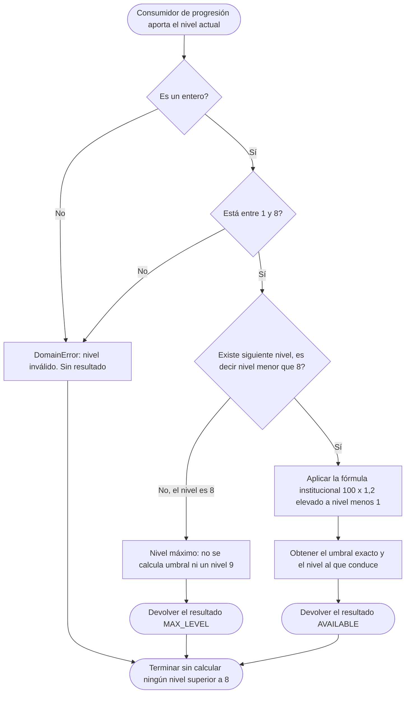
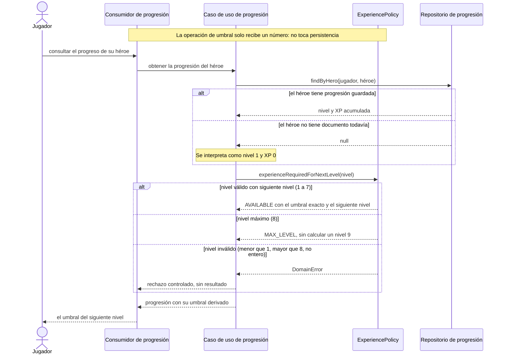
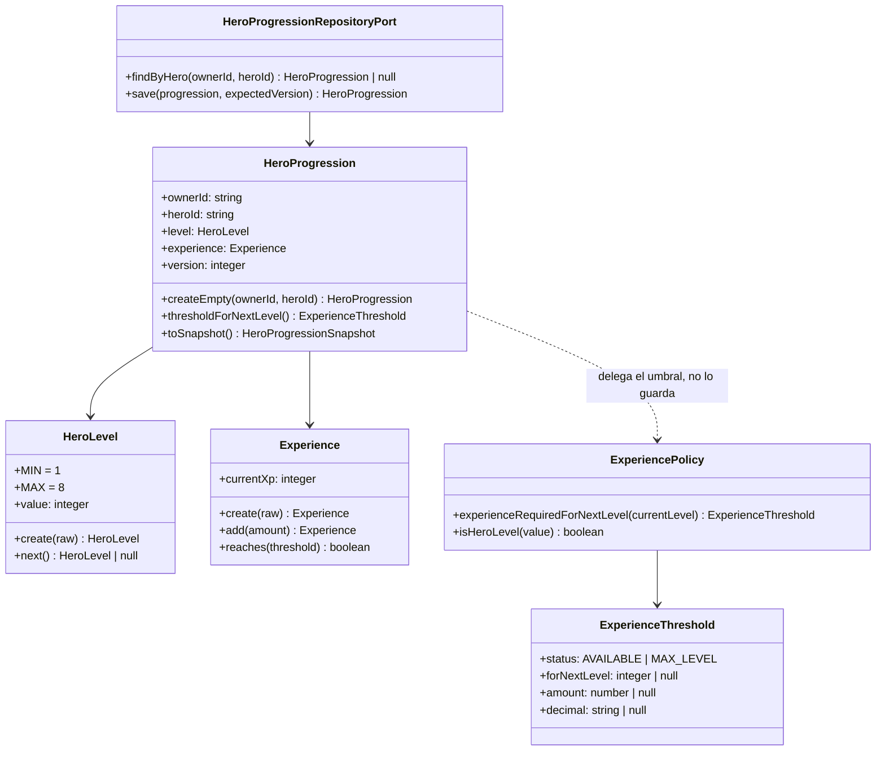

# HU-08 — Progresión del héroe: experiencia requerida por nivel

Trazabilidad: `RF-08` → Management `#17` → Tasks `#188` (este diseño), `#189`
(implementación) y `#190` (pruebas) → `ExperiencePolicy`.

- **Bounded context:** Player / Inventory
- **Team:** Alfa
- **Story Mapping:** `ACT-02 — Preparar héroe, equipo e inventario` → `Gestionar progresión y Poder`
- **Estado de este documento:** **diseño**, con el modelo de dominio ya implementado. La Task
  `#188` es la del diseño; la fórmula y la validación viven en
  `src/domain/policies/ExperiencePolicy.ts`. **No** declara la HU aceptada, **no** escribe la
  persistencia y **no** otorga experiencia: la migración y el adaptador son la Task `#189`, y
  las pruebas la Task `#190`.

## Qué es la experiencia requerida

Umbral de experiencia que un héroe necesita acumular para pasar de su **nivel actual** al
**siguiente**. Es una función determinística del nivel: no depende del héroe concreto, de su
equipamiento, de la batalla ni del azar.

| Regla de `RF-08` / HU `#17`             | Comportamiento                                                                   |
| --------------------------------------- | -------------------------------------------------------------------------------- |
| Fórmula institucional                   | `Experiencia requerida = 100 × 1,2^(Nivel − 1)`                                  |
| Rango de niveles                        | El héroe progresa de **nivel 1 a nivel 8**                                       |
| Entrada                                 | El **nivel actual** del héroe                                                    |
| Salida                                  | El **umbral** para avanzar al siguiente nivel, cuando ese siguiente nivel exista |
| Nivel máximo                            | **No** se calcula un umbral para un nivel fuera del rango                        |
| Tipo de cálculo                         | Determinístico, sin azar, sin estado, sin efectos                                |
| Disponibilidad del resultado            | El valor queda disponible como umbral del siguiente nivel                        |
| Multiplicador de estadísticas (`CA-06`) | **Fuera de alcance.** Ver «`CA-06` queda fuera, y es deliberado»                 |

## Decisión de alcance

La regla vive en el dominio del héroe de Player/Inventory como una **política pura**
(`src/domain/policies/ExperiencePolicy.ts`) y su especificación ejecutable serán las pruebas
de este repositorio (Task `#190`). **No persiste nada, no expone HTTP y no otorga
experiencia**: solo calcula el umbral.

HU-08 **no** decide quién gana una batalla, **no** genera experiencia como recompensa,
**no** ejecuta una misión, **no** genera números pseudoaleatorios, **no** diseña una
pantalla y **no** recalcula reglas de combate.

Estas seis exclusiones no son una interpretación de este documento: están escritas en el
cuerpo de la Task `#188`, que además exige que HU-08 «**no quede acoplada a una modalidad
específica como batalla o misiones**» y que en sus condiciones de finalización
«**no se incorporaron responsabilidades de batalla o misiones**».

**El umbral no se guarda.** La Task `#188` lo dice textualmente: «No crear una nueva entidad
únicamente para almacenar un valor que puede calcularse de forma determinística si no existe
otra necesidad de dominio que lo justifique». Guardarlo crearía una segunda versión de la
misma verdad y rompería el requisito de que «la fórmula existe en un **único punto
conceptual** del diseño».

**El nivel y la experiencia acumulada sí se persisten**, porque no son derivables: son el
estado del que la fórmula parte. Ver «De dónde sale el nivel».

## Contrato de dominio

Todo son funciones puras sobre valores inmutables. Ninguna muta su entrada, ninguna guarda
estado entre llamadas, ninguna conoce el reloj, la persistencia, el azar ni el framework.

```ts
export const MIN_HERO_LEVEL = 1
export const MAX_HERO_LEVEL = 8

/** Resultado discriminado: el nivel máximo es un resultado, no un error. */
export type ExperienceThreshold =
  | {
      readonly status: 'AVAILABLE'
      /** Nivel al que conduce el umbral calculado. Siempre `currentLevel + 1`. */
      readonly forNextLevel: number
      /** Valor exacto de `100 × 1,2^(currentLevel − 1)`, sin redondear. */
      readonly amount: number
      /** La misma cantidad en forma decimal canónica exacta. */
      readonly decimal: string
    }
  | {
      readonly status: 'MAX_LEVEL'
      readonly currentLevel: number
      readonly forNextLevel: null
      readonly amount: null
      readonly decimal: null
    }

export const experienceRequiredForNextLevel: (currentLevel: unknown) => ExperienceThreshold

export const isHeroLevel: (value: unknown) => value is number
```

| Función                             | Qué hace                                                                                       |
| ----------------------------------- | ---------------------------------------------------------------------------------------------- |
| `experienceRequiredForNextLevel(n)` | Valida `n`, decide si existe siguiente nivel y devuelve el umbral exacto o `MAX_LEVEL`.        |
| `isHeroLevel(value)`                | Predicado de rango: `true` solo si es entero y está entre `MIN_HERO_LEVEL` y `MAX_HERO_LEVEL`. |

`isHeroLevel` existe porque la progresión se consulta desde sitios que aún no tienen un
`HeroLevel` construido (una respuesta de Catalog, un parámetro de otro contexto) y necesitan
**preguntar** sin construir un objeto de valor que lanzaría. Es la misma razón por la que
`HeroPowerPolicy` expone `canAfford` además de `spendPower`: preguntar y decidir no deben
poder discrepar.

### Tipo de entrada y validación

La operación recibe `unknown`, no `number`. El tipo `unknown` es deliberado: obliga a validar
en la frontera, donde el dato puede venir de un documento persistido antiguo, de una
respuesta de otro servicio o de un parámetro de ruta. Se rechaza de forma controlada:

| Entrada                             | Resultado                                      |
| ----------------------------------- | ---------------------------------------------- |
| Entero entre `1` y `8`              | Válida (incluido `8`, que produce `MAX_LEVEL`) |
| `0`, negativos                      | `DomainError`                                  |
| Mayor que `8`                       | `DomainError`                                  |
| Decimal (`2.5`)                     | `DomainError`                                  |
| `NaN`, `Infinity`                   | `DomainError`                                  |
| Cadena (`"3"`), `null`, `undefined` | `DomainError`                                  |

**No se normaliza en silencio**: no se trunca `2.5` a `2`, no se convierte `"3"` a `3` y no se
recorta un `9` a `8`. La Task `#188` exige explícitamente el rechazo de «nivel inferior a 1» y
«nivel superior a 8», y normalizar convertiría un error de datos en un resultado plausible.

### Precisión: por qué el resultado no se redondea

`1,2` **no es representable en coma flotante binaria**, así que la evaluación ingenua de la
fórmula produce artefactos:

```text
100 * 1.2 ** 3  ===  172.79999999999998     // no 172.8
100 * 1.2 ** 6  ===  298.59839999999997     // no 298.5984
```

El diseño **no oculta** esto ni lo resuelve redondeando, porque el redondeo es precisamente
la decisión que la Task `#188` prohíbe tomar: «No introducir una política de redondeo
definitiva mientras no exista una decisión funcional aprobada».

La solución adoptada es **exactitud, no redondeo**: el cálculo se hace con **aritmética
racional exacta** (numerador y denominador enteros), porque `100 × 1,2^(n−1)` es una fracción
exacta:

```text
1,2        = 12 / 10
100 × 1,2^(n−1) = 100 · 12^(n−1) / 10^(n−1)
```

De ahí salen las dos formas del resultado:

- `decimal`: la **forma decimal canónica exacta** (`"172.8"`, `"298.5984"`). Es la
  representación de la que debe fiarse cualquier consumidor que muestre o compare el valor.
- `amount`: el mismo valor como `number`, para aritmética. Puede arrastrar el artefacto
  binario; por eso **no es la fuente de verdad de la presentación**.

Esto **no es** una política de redondeo: es la representación exacta de un número exacto. El
redondeo —si el PO decide que el umbral debe ser entero— sigue **pendiente** y se aplicará en
la frontera que corresponda sin tocar esta operación. Ver «Decisiones abiertas», punto 1.

### Nivel máximo y validación de rango

El nivel máximo es un **resultado**, no una excepción. Confundirlos impediría distinguir «este
héroe ya no puede subir» de «me han pasado un nivel inválido», que son situaciones opuestas.

| Nivel actual  | `status`    | Umbral calculado             | Interpretación                       |
| ------------- | ----------- | ---------------------------- | ------------------------------------ |
| `1`           | `AVAILABLE` | `100` para el nivel `2`      | Puede progresar                      |
| `2`           | `AVAILABLE` | `120` para el nivel `3`      | Puede progresar                      |
| `3`           | `AVAILABLE` | `144` para el nivel `4`      | Puede progresar                      |
| `4`           | `AVAILABLE` | `172.8` para el nivel `5`    | Puede progresar                      |
| `5`           | `AVAILABLE` | `207.36` para el nivel `6`   | Puede progresar                      |
| `6`           | `AVAILABLE` | `248.832` para el nivel `7`  | Puede progresar                      |
| `7`           | `AVAILABLE` | `298.5984` para el nivel `8` | **Último nivel con siguiente nivel** |
| `8`           | `MAX_LEVEL` | —                            | Nivel máximo: **no existe nivel 9**  |
| `< 1` o `> 8` | —           | —                            | `DomainError`                        |

> **Decisión de diseño sobre el rango de entrada:** el `8` es **entrada válida**. La
> alternativa —rechazarlo como fuera de rango— haría que «nivel máximo» y «nivel inválido»
> fueran el mismo caso, y `CA-05` pide distinguir precisamente el primero: «el sistema no debe
> calcular un siguiente nivel fuera del rango máximo establecido». Con esta decisión, la
> operación **se define para todo el rango `1..8`** y para ningún valor más.

Los valores de la tabla son **teóricos y exactos**, tal como los produce la fórmula. **No se
declara ninguno como «el» valor de producción**: mientras la política de redondeo no esté
aprobada, esta tabla documenta el resultado matemático, no un valor redondeado.

## De dónde sale el nivel

El nivel **pertenece al héroe, no al jugador**: un jugador puede tener varios héroes y cada uno
progresa por su cuenta. Es la misma decisión que HU-11 tomó para el Poder («Pertenece **al
héroe, no al jugador**: cada héroe lleva su propio Poder actual y su propio máximo, y el de uno
nunca se consume, recupera ni mezcla con el de otro héroe del mismo jugador»).

### Dónde vive el estado y dónde no

| Concepto                            | Dónde vive                                             | Por qué                                                                                       |
| ----------------------------------- | ------------------------------------------------------ | --------------------------------------------------------------------------------------------- |
| **Nivel actual** y **XP acumulada** | **`HeroProgression`**, agregado por `(jugador, héroe)` | Estado del héroe, no derivable; necesita bloqueo optimista como sus hermanos                  |
| **El umbral**                       | **En ningún sitio.** Se calcula                        | Es derivable del nivel; persistirlo duplicaría la verdad y rompería el único punto conceptual |
| **La selección del héroe**          | `HeroSelection` (HU-07)                                | Es una _selección_, no una copia del héroe                                                    |
| **El equipamiento**                 | `HeroLoadout` (HU-28)                                  | Agregado propio por `(jugador, héroe)`                                                        |
| **Las estadísticas base**           | Catalog                                                | Player/Inventory no las posee                                                                 |

`HeroSelection` documenta expresamente que «**Ni las estadísticas ni el equipamiento viven
aquí**… Duplicarlos daría dos versiones de la misma verdad». Por esa misma razón la progresión
**no** se anida en la selección: es un **tercer agregado hermano**, con la misma forma que
`HeroLoadout` —clave por `(jugador, héroe)`, campo `version` para bloqueo optimista,
`createEmpty`/`restore`/`toSnapshot`— y su propio puerto de persistencia.

```ts
export interface HeroProgressionSnapshot {
  readonly ownerId: string
  readonly heroId: string
  readonly level: number
  readonly currentXp: number
  readonly version: number
}

export class HeroProgression {
  static createEmpty(ownerId: string, heroId: string): HeroProgression // nivel 1, XP 0
  static restore(snapshot: HeroProgressionSnapshot): HeroProgression
  get version(): number
  /** Umbral para el siguiente nivel, delegando en la política. No se almacena. */
  thresholdForNextLevel(): ExperienceThreshold
  toSnapshot(): HeroProgressionSnapshot
}
```

**Creación perezosa:** un héroe sin documento de progresión se interpreta como **nivel 1 con XP
0**. No se hace _backfill_ ni se crean documentos al seleccionar un héroe: el estado inicial es
el valor por defecto del dominio, no un dato que haya que sembrar.

### Modelo de datos (diseñado aquí, implementado en `#189`)

Este documento **no** crea la migración. Define su forma para que `#189` la implemente sin
volver a decidir:

| Aspecto          | Valor                                                                                                     |
| ---------------- | --------------------------------------------------------------------------------------------------------- |
| Colección        | `hero-progressions`                                                                                       |
| Clave `_id`      | Cadena `"<ownerId>:<heroId>"`, el mismo estilo de clave compuesta que `hero-loadouts`                     |
| Campos           | `ownerId`, `heroId`, `level` (`int`, `1..8`), `currentXp` (`int`, `≥ 0`), `version` (`int`, `≥ 0`)        |
| Validador        | `$jsonSchema` con `additionalProperties: false`, `validationLevel: 'strict'`, `validationAction: 'error'` |
| Índice           | `{ ownerId: 1, heroId: 1 }`, único                                                                        |
| **No se guarda** | El **umbral**, ni como campo, ni como caché, ni como proyección                                           |
| Herramienta      | Migración numerada `007-hero-progressions`, siguiendo el patrón de `006`                                  |

`currentXp` **no tiene techo en el esquema**. El techo es el umbral, que es derivado y cambia
con el nivel; imponer un máximo fijo exigiría recalcular y reescribir el documento en cada
subida. Lo que impide que la XP crezca sin control es la regla de subida de nivel, que es de
HU-09 y no se diseña aquí.

## Caso de uso

- **Identificador:** `UC-HU08-01` — Consultar la experiencia requerida para el siguiente nivel.
- **Actor:** `Jugador`. En la práctica, el consumidor de progresión actúa en su nombre: el
  caso de uso de lectura resuelve el héroe del jugador autenticado; la operación de umbral no
  autentica a nadie porque solo recibe un número.
- **Objetivo:** conocer cuánta experiencia necesita un héroe para alcanzar el siguiente nivel,
  para hacer seguimiento de su progreso y planear su evolución.
- **Precondiciones:** el héroe está identificado y su nivel pertenece al rango `1..8`. El
  umbral no requiere que el héroe exista en Catalog: es función del nivel, no del héroe.
- **Entrada:** el **nivel actual** del héroe (entero `1..8`).
- **Flujo principal — el héroe todavía puede progresar:**
  1. El consumidor aporta el nivel actual del héroe.
  2. La política valida que sea un entero del rango permitido.
  3. Determina que **existe** siguiente nivel (`nivel < 8`).
  4. Aplica la fórmula institucional.
  5. Obtiene el umbral exacto y el nivel al que conduce.
  6. Devuelve `{ status: 'AVAILABLE', forNextLevel, amount, decimal }`.
- **Flujos alternativos:**
  - **A1 — Nivel máximo:** el nivel es `8`. No existe siguiente nivel. Devuelve
    `{ status: 'MAX_LEVEL' }` **sin calcular umbral y sin producir un nivel 9**.
  - **A2 — Nivel inválido:** el nivel es menor que `1`, mayor que `8`, no entero o de tipo
    incorrecto. Lanza `DomainError` y no produce ningún resultado.
- **Excepciones:** únicamente la entrada inválida de A2. No hay excepciones de
  infraestructura porque no hay infraestructura: la operación no lee ni escribe nada.
- **Postcondiciones:** se devuelve un resultado nuevo; **el nivel consultado no se modifica**
  (es un valor, no un estado mutable); no se persiste nada; no se otorga ni se consume
  experiencia; el resultado es el mismo ante entradas iguales.
- **Reglas y aceptación:** `RF-08` y las restricciones de la HU `#17`; `CA-01` a `CA-05` y
  `CA-07` (ver «Trazabilidad de reglas»). `CA-06` queda fuera de alcance.
- **Trazabilidad:** `RF-08` → HU-08 (`#17`) → Tasks `#188`, `#189`, `#190` → este documento y
  `ExperiencePolicy`.

## Diagrama de actividades



El diagrama reproduce los ocho pasos que la Task `#188` exige representar. La rama de rechazo
y la de nivel máximo convergen en la misma salida final —«finalizar sin calcular un nivel
superior a 8»—, que es la condición que `CA-05` comprueba.

## Diagrama de secuencia



El repositorio aparece **solo en el caso de uso de lectura**, que es el único punto donde hace
falta consultar el nivel desde persistencia. La **regla** no lo toca: la Task `#188` dibuja el
`Repositorio de Héroe` como participante «únicamente cuando sea necesario consultar el nivel
desde persistencia», y esa necesidad es del caso de uso, no de la fórmula.

## Modelo



### Alternativa rechazada: persistir el umbral

Se evaluó guardar `experienceRequiredForNextLevel` dentro de `HeroProgression` (un campo
`nextLevelThreshold`) y **se rechaza** por tres motivos, en este orden:

1. **Duplicaría un valor derivado.** El umbral se calcula del nivel; almacenarlo crea una
   segunda versión de la misma verdad que puede quedar desincronizada.
2. **Rompería el requisito de único punto conceptual.** La Task `#188` exige que «la fórmula
   existe en un **único punto conceptual** del diseño»; un campo persistido invita a leerlo en
   lugar de calcularlo, y a la larga a recalcularlo en otro sitio.
3. **La Task lo prohíbe.** «No crear una nueva entidad únicamente para almacenar un valor que
   puede calcularse de forma determinística si no existe otra necesidad de dominio que lo
   justifique». No existe hoy esa otra necesidad.

### Relación con los agregados vecinos

```text
Jugador
  │
  ├── Inventory        (qué posee)                     HU-27, HU-38
  ├── HeroSelection    (qué héroe tiene preparado)     HU-07   una por jugador
  ├── HeroLoadout      (qué lleva equipado el héroe)   HU-28   una por (jugador, héroe)
  └── HeroProgression  (nivel y XP del héroe)          HU-08   una por (jugador, héroe)
```

Los cuatro son independientes y ninguno contiene a otro. La progresión **no** modifica el
loadout, **no** modifica la selección y **no** cambia las estadísticas.

## Contrato del servicio de progresión

La Task `#188` pide definir «la operación del contrato del servicio responsable de progresión»
y añade que «**no es obligatorio exponer esta operación mediante HTTP** si la arquitectura
final determina otro mecanismo de interacción».

| Aspecto                      | Definición                                                                                     |
| ---------------------------- | ---------------------------------------------------------------------------------------------- |
| **Propósito**                | Obtener el umbral de experiencia requerido para avanzar del nivel actual al siguiente          |
| **Entrada**                  | `currentLevel`: entero `1..8`. Es la **única** entrada                                         |
| **Salida**                   | `ExperienceThreshold`: `AVAILABLE` con `{ forNextLevel, amount, decimal }`, o `MAX_LEVEL`      |
| **Validaciones**             | Entero; `1 ≤ n ≤ 8`; sin truncar, sin convertir cadenas, sin recortar al máximo                |
| **Nivel máximo**             | `n = 8` → `MAX_LEVEL`. No es error. Nunca se calcula el umbral del nivel 9                     |
| **Errores funcionales**      | No entero · fuera de `1..8` · ausente · tipo incorrecto → `DomainError` con mensaje en español |
| **Efectos**                  | Ninguno. No escribe, no publica eventos, no consume azar, no muta la entrada                   |
| **Idempotencia**             | Total: la misma entrada produce siempre el mismo resultado                                     |
| **Mecanismo de interacción** | **En proceso.** No hay endpoint público ni interno (ver «Decisiones abiertas», punto 5)        |

**Ejemplos:**

```text
experienceRequiredForNextLevel(1)  → { status: 'AVAILABLE', forNextLevel: 2, amount: 100,      decimal: '100' }
experienceRequiredForNextLevel(4)  → { status: 'AVAILABLE', forNextLevel: 5, amount: 172.8,    decimal: '172.8' }
experienceRequiredForNextLevel(7)  → { status: 'AVAILABLE', forNextLevel: 8, amount: 298.5984, decimal: '298.5984' }
experienceRequiredForNextLevel(8)  → { status: 'MAX_LEVEL', currentLevel: 8, forNextLevel: null, amount: null, decimal: null }
experienceRequiredForNextLevel(0)  → DomainError
experienceRequiredForNextLevel(9)  → DomainError
experienceRequiredForNextLevel(2.5)→ DomainError
experienceRequiredForNextLevel('3')→ DomainError
```

### Reutilización: `#189` no debe crear una segunda fórmula

La Task `#189` prohíbe textualmente que la fórmula «quede duplicada en HU-09, HU-10 ni en otros
módulos». La operación de lectura que consumen los demás casos de uso es una sola:

```ts
export class QueryExperienceThreshold {
  /** Delega íntegramente en `ExperiencePolicy`. No reimplementa la fórmula. */
  execute(currentLevel: unknown): ExperienceThreshold
}
```

Los consumidores previstos son **HU-09** (`#18`, victoria en batalla), **HU-10** (`#19`,
misión completada) y la vista de progreso del héroe. Ninguno aplica la fórmula: todos piden el
umbral y lo comparan con la XP acumulada.

## Impacto arquitectónico y fronteras

- La progresión es un atributo **del héroe**: su regla vive en el dominio de Player/Inventory,
  que ya es la fuente de verdad del héroe y de su equipamiento. No está en el comercio
  electrónico y no se copia en Misiones.
- **Consumidores previstos:** HU-09 (`#18`) al acreditar experiencia por victoria; HU-10
  (`#19`) al acreditar experiencia por misión; y una futura vista de progreso del héroe.
  Consumen el umbral y **no reimplementan la fórmula**.
- **Fronteras:** HU-07 (selección) solo identifica el héroe. HU-28 (equipamiento) aporta las
  estadísticas efectivas, que **no** intervienen aquí. HU-29 (bloqueo en combate) es indiferente
  a la progresión: subir de nivel no cambia el loadout. HU-11 (Poder) **no** interviene: su
  máximo viene de `effectiveStats.power` y su política documenta que no depende del nivel.
- **Persistencia involucrada:** una colección nueva, `hero-progressions`, con la forma de la
  tabla anterior. Nada más.
- **Separación entre cálculo de progresión y otorgamiento de recompensas:** este diseño calcula
  el **umbral**. **No** acredita experiencia, **no** sube de nivel, **no** decide cuándo se
  otorga experiencia y **no** publica eventos. Esa separación la exige la Task `#188` en su
  paso 9 y es el motivo de que la operación sea pura y sin efectos.
- **No hay endpoint nuevo.** El SAD registra como limitación vigente que «los puertos existen;
  el transporte no»; añadir transporte aquí no lo pide ninguna Task.

## Compatibilidad con trabajo aprobado

- **HU-27 / HU-07** aportan la propiedad y la selección del héroe: identifican **de qué héroe**
  se consulta el progreso. HU-08 no las modifica.
- **HU-28** aporta `HeroLoadout` y `computeEffectiveStats`. HU-08 **no** toca las estadísticas
  efectivas ni el recálculo: el umbral no depende del equipamiento.
- **HU-11** aporta `HeroPowerPolicy`, que **no depende del nivel** y recibe su máximo ya
  resuelto. Por eso HU-08 no introduce ningún cambio en el Poder, y el precedente ya
  documentado —«La tabla de nivel 1 no define una formula para niveles superiores y aqui no se
  inventa ninguna»— sigue siendo válido.
- **Catalog** aporta la definición del héroe (sus estadísticas base y su subtipo). HU-08 **no**
  añade ningún atributo de producto: el nivel es estado del jugador, no del catálogo.
- **HU-15** entrega el héroe equipado a Combat por el contrato interno `equipped-hero`. Ese DTO
  es hoy un **subconjunto deliberado** que **no lleva nivel**, y este diseño **no lo cambia**
  (ver «Decisiones abiertas», punto 4).

## Trazabilidad de reglas

Cada restricción de la HU `#17` frente a lo que la cumple. Las pruebas son la Task `#190`; este
documento fija la matriz que `#190` debe materializar.

| Restricción de la HU `#17` / `RF-08`                                          | Cómo se cumple                                                        | Escenario de prueba           |
| ----------------------------------------------------------------------------- | --------------------------------------------------------------------- | ----------------------------- |
| El umbral se calcula con `100 × 1,2^(Nivel−1)`                                | `experienceRequiredForNextLevel` aplica la fórmula en un único punto  | niveles 1 a 7                 |
| El cálculo usa como entrada el nivel actual                                   | La firma recibe `currentLevel` y **nada más**                         | cualquier nivel válido        |
| Los héroes progresan de nivel 1 a 8                                           | `MIN_HERO_LEVEL` / `MAX_HERO_LEVEL`; `HeroLevel` valida la invariante | 1, intermedio, 7, 8           |
| El sistema no calcula un siguiente nivel fuera del rango máximo               | `n = 8` → `MAX_LEVEL`; nunca se calcula el nivel 9                    | nivel 8                       |
| El valor queda disponible como umbral del siguiente nivel                     | `QueryExperienceThreshold` lo expone a los consumidores               | lectura desde el caso de uso  |
| **El nivel actúa como factor multiplicador sobre las estadísticas (`CA-06`)** | **FUERA DE ALCANCE.** Ver la sección siguiente                        | **Ninguno: no se automatiza** |
| Un criterio obligatorio fallido impide aceptar la HU (`CA-08`)                | Tabla de evidencia en Infrastructure, **sin declarar la HU aceptada** | —                             |

- **`CA-01`:** el nivel de entrada produce el umbral del siguiente nivel — filas 1 y 5.
- **`CA-02`:** el rango `1..8` está representado explícitamente — fila 3 y la tabla de niveles.
- **`CA-03`:** la fórmula es la institucional y aparece una sola vez — fila 1.
- **`CA-04`:** la entrada es el nivel actual — fila 2.
- **`CA-05`:** no se calcula fuera del rango — fila 4.
- **`CA-07`:** el valor queda disponible — fila 5.

## `CA-06` queda fuera, y es deliberado

`CA-06` dice: «el nivel del héroe actúa como factor multiplicador sobre el resto de sus
estadísticas conforme a las reglas del juego». **Este diseño no lo implementa, no lo modela y
no lo prueba.** No es un olvido; es una frontera, y tiene tres fundamentos verificables:

1. **La propia HU declara la materia fuera de alcance.** El cuerpo de la Task `#188` enumera lo
   que HU-08 **no** es responsable de hacer, y esa lista incluye **«recalcular reglas de
   combate»**. Las estadísticas del héroe son materia de combate.
2. **La Task exige no acoplarse.** `#188` pide que HU-08 «no quede acoplada a una modalidad
   específica como batalla o misiones», y en sus condiciones de finalización exige que «**no se
   incorporaron responsabilidades de batalla o misiones**».
3. **No existe fórmula en ninguna fuente.** Ni el Issue `#17`, ni las tres Tasks, ni `ADR-019`,
   ni `ADR-021`, ni ningún contrato del proyecto definen cómo multiplica el nivel. La única
   frase es «conforme a las reglas del juego», que no es una fórmula. El precedente ya
   registrado en este mismo repositorio es explícito: «La tabla de nivel 1 no define una
   formula para niveles superiores y **aqui no se inventa ninguna**».

**No se automatiza ninguna prueba que fije ese comportamiento**, siguiendo el patrón que HU-07
aplicó a su `CA-09`:

> «Tampoco deben convertir en prueba de HU-07 la regla de modificación durante combate, ya que
> pertenece a HU-29 y actualmente existe una inconsistencia documental que debe ser resuelta
> antes de automatizar dicho comportamiento como requisito definitivo.»

**Consecuencia que hay que dejar escrita:** como `CA-08` establece que «un criterio obligatorio
fallido impide aceptar la HU», y `CA-06` es obligatorio y no puede aprobarse, **HU-08 no puede
aceptarse mientras `CA-06` siga en su redacción actual**. La salida es una decisión del Product
Owner y de arquitectura, con tres opciones y ninguna elegible por este documento:

- **(a)** definir la fórmula y asignarla a HU-08, aceptando que la HU crezca hacia las
  estadísticas;
- **(b)** reconocer que pertenece a otra historia —HU-28 o una historia de estadísticas— y
  **retirarla o moverla**;
- **(c)** reformularla como criterio **no obligatorio**.

Hasta que se decida, este diseño entrega todo lo demás y **señala el hueco en lugar de
taparlo**.

## Matriz de escenarios de prueba

Los seis escenarios que la Task `#188` exige dejar identificados, con su resultado esperado.
La Task `#190` los materializará en `test/unit/experience-policy.spec.ts`.

| #   | Escenario          | Entrada   | Resultado esperado                                    | Tipo     |
| --- | ------------------ | --------- | ----------------------------------------------------- | -------- |
| 1   | Nivel 1            | `1`       | `AVAILABLE`, `forNextLevel: 2`, `decimal: '100'`      | Positivo |
| 2   | Nivel intermedio   | `4`       | `AVAILABLE`, `forNextLevel: 5`, `decimal: '172.8'`    | Positivo |
| 3   | Nivel 7            | `7`       | `AVAILABLE`, `forNextLevel: 8`, `decimal: '298.5984'` | Frontera |
| 4   | Nivel 8            | `8`       | `MAX_LEVEL`, sin umbral, **nunca un nivel 9**         | Frontera |
| 5   | Nivel inferior a 1 | `0`, `-1` | `DomainError`                                         | Negativo |
| 6   | Nivel superior a 8 | `9`       | `DomainError`                                         | Negativo |

Escenarios adicionales que `#190` debe cubrir por derivarse de las mismas reglas:

| #   | Escenario                 | Entrada              | Resultado esperado                                   |
| --- | ------------------------- | -------------------- | ---------------------------------------------------- |
| 7   | Nivel no entero           | `2.5`                | `DomainError`                                        |
| 8   | Entrada de otro tipo      | `'3'`, `null`, `NaN` | `DomainError`                                        |
| 9   | Fórmula en un único punto | —                    | La fórmula aparece **una sola vez** en el código     |
| 10  | Pureza                    | Cualquiera           | La entrada no se muta; sin estado entre llamadas     |
| 11  | Exactitud                 | `4`, `6`             | `'172.8'` y `'248.832'`, **no** `172.79999999999998` |
| 12  | Idempotencia              | Repetir la llamada   | Mismo resultado exacto                               |

### Control que fallaría si la regla fuera falsa

La Task `#188` señala como riesgo técnico «duplicar la fórmula en varios módulos». Afirmar que
no se duplica no basta: hace falta un control que **falle si la afirmación es falsa** —el mismo
criterio con el que HU-07 probó su «noveno héroe» y con el que Combat guarda la aleatoriedad
(`hu-25-no-alternative-randomness.spec.ts`).

`#190` debe incluir una prueba que recorra los fuentes del servicio y **falle si aparece una
segunda evaluación de la fórmula fuera de `ExperiencePolicy`**. El diseño deja fijado el
control; su implementación es de `#190`.

> **Precisión necesaria para quien escriba esa prueba.** La política **menciona** la fórmula en
> sus comentarios —explica por qué no se multiplica directamente— y **evalúa** la versión
> ingenua `100 * 1.2 ** 3` precisamente para documentar el artefacto de coma flotante. Una
> búsqueda ingenua del literal `1.2` daría un **falso positivo contra el propio archivo
> correcto**. El control debe:
>
> - **excluir `ExperiencePolicy.ts`** del barrido, o
> - analizar **estructura** en lugar de texto: la presencia de una potencia elevada a
>   `nivel − 1`, o de un literal `1.2` **fuera de un comentario**.
>
> Es el mismo problema que ya resolvieron las guardas de aleatoriedad de Combat, que enumeran a
> mano los archivos vigilados para no marcarse a sí mismas.

## Pruebas y evidencia

Este diseño **no ejecuta pruebas**: no implementa la política. La Task `#190` es la que las
automatiza. Lo que sí se dejó preparado aquí:

- la **matriz de 12 escenarios** de la sección anterior, con resultado esperado por escenario;
- la **tabla de niveles 1..8** con los valores exactos que las pruebas deben fijar;
- el **control de no-duplicación** de la fórmula;
- la lista de entradas inválidas que deben rechazarse sin normalizar.

**Línea base medida** antes de este diseño: en `develop`, la suite unitaria de
Player-Inventory está en **23 suites / 585 pruebas, todas en verde**. La Task `#190` debe
partir de ahí sin regresiones.

**Evidencia de este diseño (lo que sí existe al terminar `#188`):** este documento con el caso
de uso textual, los dos diagramas, el fragmento del modelo de dominio, la revisión del modelo
de datos, el contrato de la operación y las secciones afectadas del SAD. La tabla de «qué se
comprobó y qué NO» vive en la evidencia de Infrastructure, siguiendo el patrón de HU-07.

## Decisiones abiertas

Ninguna de estas las ha decidido el Product Owner. Las que afectan al código tienen una
elección conservadora que se puede cambiar sin tocar el resto.

1. **Política de precisión y redondeo.** Es la decisión que la Task `#188` nombra como
   pendiente. Este diseño **no la toma**: devuelve el valor **exacto** en forma decimal
   canónica y deja el redondeo al consumidor. Si el PO decide que el umbral se expresa en
   enteros, se aplica en la frontera de presentación sin cambiar la operación. Nota útil para
   decidirla: como el umbral **no se persiste**, cambiar el redondeo más adelante **no exige
   migración de datos**.
2. **`CA-06` — el nivel como multiplicador de estadísticas.** Es un criterio obligatorio sobre
   materia que la HU declara fuera de alcance y sin fórmula en ninguna fuente. Bloquea la
   aceptación formal de HU-08. Ver «`CA-06` queda fuera, y es deliberado».
3. **Persistencia del nivel y de la XP.** Este diseño propone `HeroProgression` como agregado
   por `(jugador, héroe)` con una colección nueva. Es una **propuesta de arquitectura basada en
   el precedente de HU-11** («el Poder pertenece al héroe, no al jugador») y en la simetría con
   `HeroLoadout`; no una decisión ratificada. Si el PO quisiera XP **por jugador** en lugar de
   por héroe, cambiaría la clave del agregado y nada más.
4. **Si el nivel debe viajar a Combat.** Hoy el contrato interno `equipped-hero` es un
   subconjunto deliberado que **no lleva nivel**, y su propio código documenta que «Si Combat
   necesita escalar por nivel, es una decision de producto pendiente». Este diseño **no lo
   cambia**. Si `CA-06` se resolviera en el sentido de escalar estadísticas en combate, habría
   que ampliar `EquippedHeroDto` y su contrato, y eso es un cambio de contrato con su propio
   proceso.
5. **Si hará falta una superficie HTTP.** `#188` permite no exponerla. Hoy no hay consumidor
   externo identificado: HU-09 vive en Combat y tendría que recibir el umbral por el contrato
   interno que ya use, y HU-10 vive en Missions. Si aparece la necesidad, la operación pura ya
   está lista y solo habría que envolverla.
6. **Quién acredita la experiencia y cómo se sube de nivel.** Es **HU-09**, no HU-08. Este
   diseño define el umbral y el modelo de progresión; la regla de cuándo se cruza el umbral,
   si se puede subir más de un nivel con una recompensa, y qué ocurre en el nivel máximo al
   ganar experiencia, quedan de esa historia.
7. **El nivel inicial y la XP inicial.** Se fijan en **nivel 1 con XP 0** por creación
   perezosa. La HU no define un valor inicial distinto y el rango empieza en 1; no se inventa
   otro.
