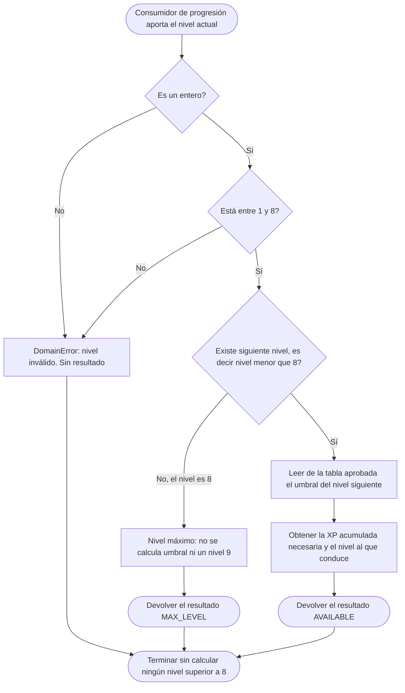
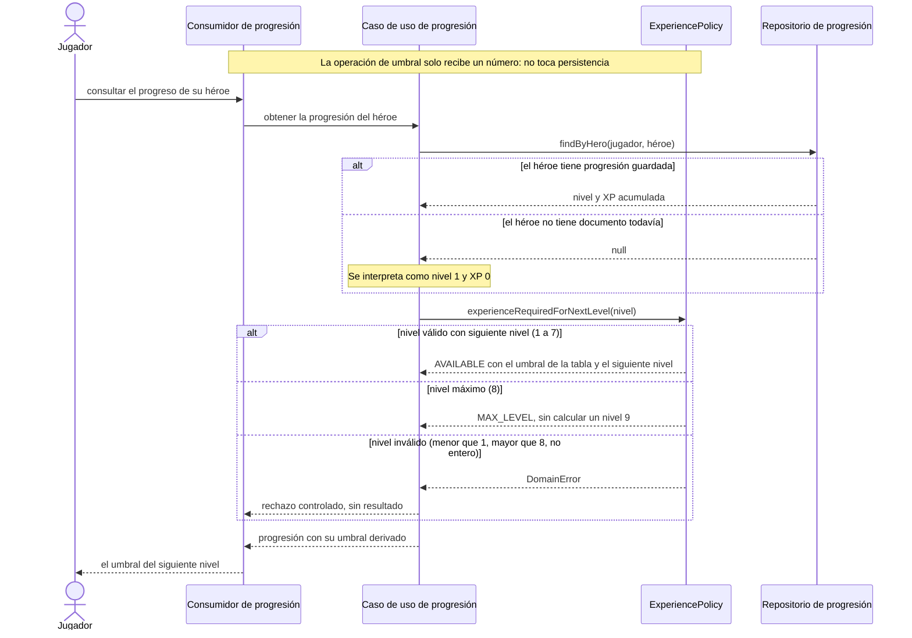
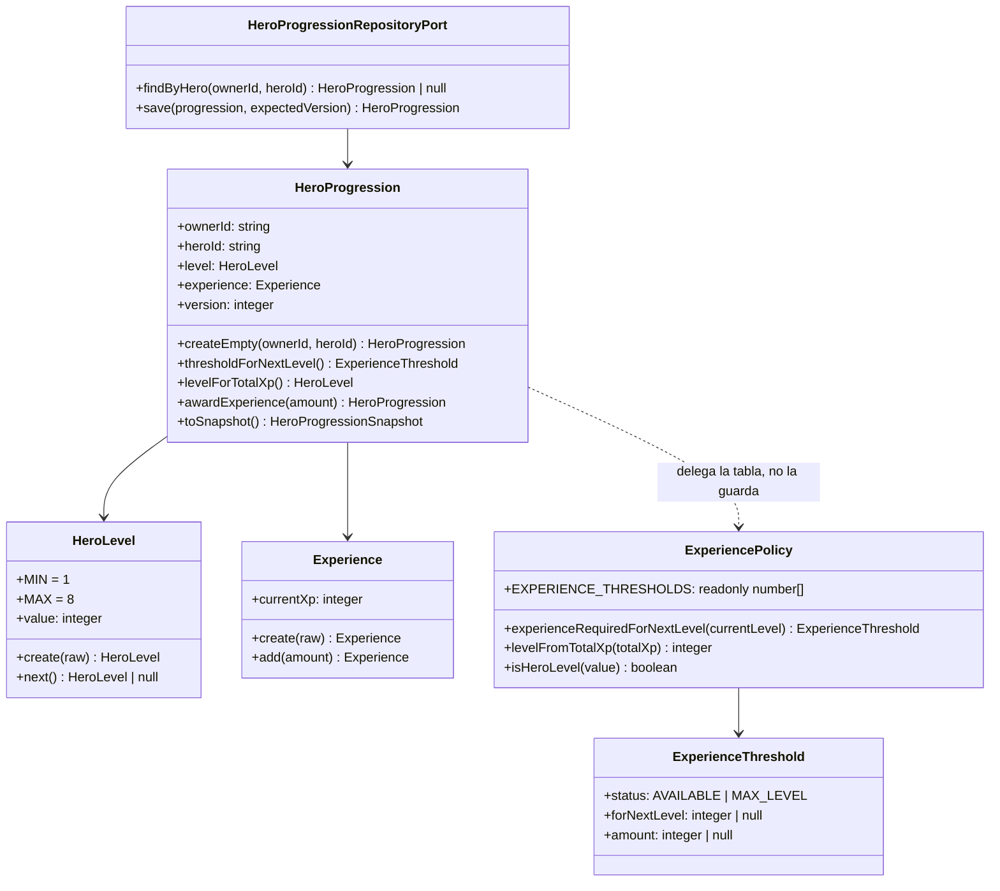

# HU-08 — Progresión del héroe: experiencia requerida por nivel

Trazabilidad: `RF-08` → Management `#17` → Tasks `#188` (este diseño), `#189`
(implementación) y `#190` (pruebas) → `ExperiencePolicy`.

- **Bounded context:** Player / Inventory
- **Team:** Alfa
- **Story Mapping:** `ACT-02 — Preparar héroe, equipo e inventario` → `Gestionar progresión y Poder`
- **Estado de este documento:** **diseño implementado y probado, ajustado a la aclaración
  funcional del Product Owner.** La Task `#188` entregó el diseño, la `#189` lo llevó a código y
  la `#190` construyó su suite: la tabla de umbrales vive en
  `src/domain/policies/ExperiencePolicy.ts`, el agregado en `HeroProgression`, su persistencia en
  la migración `008-hero-progressions`, y la trazabilidad de las pruebas en
  [hu-08-matriz-de-pruebas.md](hu-08-matriz-de-pruebas.md). **No** declara la HU aceptada —eso
  requiere revisión por pares y aceptación del PO— y **no** reparte experiencia por sí sola:
  acreditar XP es HU-09 (batalla) y HU-10 (misiones).

## 0. Vigencia: qué manda hoy, y de dónde sale cada decisión

Este documento mezcla cuatro cosas que conviene no confundir, porque una de ellas **cambió el
comportamiento ya diseñado**. Se separan aquí para que la revisión pueda aceptar unas y discutir
otras sin tener que reconstruir el historial.

### 0.1 Requisito original (enunciado de la HU `#17`, y `CA-03`)

| Qué dice                                                                        | Dónde vive       |
| ------------------------------------------------------------------------------- | ---------------- |
| `Experiencia requerida = 100 × 1,2^(Nivel − 1)`                                 | `CA-03` de `#17` |
| Los héroes progresan de **nivel 1 a nivel 8**                                   | `RF-08`          |
| La entrada es el **nivel actual** del héroe                                     | `#17`            |
| No se calcula un siguiente nivel fuera del rango                                | `CA-05` de `#17` |
| El nivel actúa como **factor multiplicador** sobre el resto de las estadísticas | `CA-06` de `#17` |

### 0.2 Aclaración funcional del Product Owner (posterior al enunciado, y aprobada)

**No forma parte de la HU original ni de su documentación fuente: es una aclaración del PO
posterior.** Es la que gobierna hoy el cálculo, y sustituye a la fórmula de `CA-03`.

| Punto aclarado                                      | Contenido                                                                                                                          |
| --------------------------------------------------- | ---------------------------------------------------------------------------------------------------------------------------------- |
| **Tabla de umbrales aprobada**                      | `100 · 200 · 400 · 800 · 1.600 · 3.200 · 6.400 · 12.800`, acumulados, uno por nivel de 1 a 8, **enteros**                          |
| **Nivel a partir del acumulado**                    | `nivel(xp) = mayor L de 1..8 tal que xp ≥ UMBRAL[L]`; por debajo del primer umbral, nivel 1                                        |
| **La XP es acumulada y no se resta**                | Al subir de nivel no se descuenta nada: `749 + 100 = 849`, nivel 4, y el héroe conserva los 849                                    |
| **Un solo otorgamiento puede subir varios niveles** | El nivel se calcula directamente sobre el acumulado nuevo: `190 + 700 = 890` deja al héroe en el nivel **4**, no en el 2           |
| **Tope en el nivel 8**                              | La XP sigue creciendo y **no se descarta**; la operación **no se rechaza**: `13.000 + 500 = 13.500`, nivel 8. No existe el nivel 9 |
| **La XP es entera**                                 | La recompensa se redondea al entero más próximo antes de acreditarse                                                               |
| **La XP es del héroe, no del jugador**              | Cada héroe lleva su propio acumulado y su propio nivel                                                                             |
| **De dónde sale la XP**                             | De la **muerte de NPC en misiones (JvE)**, cuya recompensa es `10 × 1,2^(1d8)`. **No** de PvP ni de «Jugar Online»                 |
| **El nivel multiplica las estadísticas base**       | `estadística base del nivel 1 × nivel actual`, y **después** se aplica el equipamiento                                             |

### 0.3 Decisión arquitectónica (de otros documentos, no de esta HU)

- **`ADR-019`** (`Accepted`): Player/Inventory es dueño de los **compromisos** del héroe
  (`BATTLE`, `MISSION`, `AUCTION`, `TOURNAMENT`); Combat compromete al iniciar y libera al
  terminar, de forma **síncrona** y con `operationId`.
- **`ADR-021`** (`Accepted`): Combat es la **única** autoridad de aleatoriedad del sistema
  (`MT19937` → `BoundedRandom.nextInt(bound)`), con **una sola secuencia compartida**
  `BATTLE_RANDOM` / `BATTLE_RANDOM_SEQUENCE` sembrada al arrancar. **No hay** `/random`, `/rng`
  ni `/seed`, **no hay** microservicio de aleatoriedad y **no hay** generador en Missions.
- Consecuencia para HU-08: **ni la tirada ni la recompensa se calculan aquí.** La tabla de
  umbrales es lo único que pertenece a esta historia.

### 0.4 Decisiones técnicas de este diseño (y solo estas)

| Decisión                                                                                 | Por qué                                                                                                            |
| ---------------------------------------------------------------------------------------- | ------------------------------------------------------------------------------------------------------------------ |
| La tabla vive **únicamente** en `ExperiencePolicy`, como literal de ocho enteros         | La Task `#188` exige un **único punto conceptual**; una tabla literal se contrasta línea a línea con lo aprobado   |
| `amount` es la **XP acumulada necesaria para alcanzar** `forNextLevel`, no un incremento | Es lo que la tabla dice y lo que `levelFromTotalXp` compara; la otra lectura confundiría a HU-09                   |
| Se **retira** el campo `decimal` y la aritmética racional con `BigInt`                   | Existían para representar sin error `100 × 1,2^(n−1)`. Con la tabla entera no hay fracción que representar         |
| `restore` rechaza un documento cuyo nivel no corresponda a su acumulado                  | El nivel es la tabla aplicada al acumulado: si no cuadra, el dato está corrupto                                    |
| `awardExperience` **no** incrementa `version`                                            | El bloqueo optimista lo gobierna el repositorio, que es quien conoce la versión almacenada                         |
| Se implementa `awardExperience` aquí y no en HU-09                                       | Es aritmética del agregado y mantiene la invariante en un solo sitio; **quién** otorga XP sigue siendo HU-09/HU-10 |

## 1. Qué está implementado y qué no

| Pieza                                                                               | Estado                                                                       |
| ----------------------------------------------------------------------------------- | ---------------------------------------------------------------------------- |
| Tabla de umbrales, validación de rango y nivel máximo (`ExperiencePolicy`)          | **Implementado**                                                             |
| `levelFromTotalXp` (acumulado → nivel), con salto de varios niveles                 | **Implementado**                                                             |
| `HeroLevel`, `Experience` (con `add`), `HeroProgression` (con `awardExperience`)    | **Implementado**                                                             |
| Persistencia: migración `008-hero-progressions` y colección `hero-progressions`     | **Implementado**                                                             |
| Adaptadores Mongo y en memoria, con bloqueo optimista                               | **Implementado**                                                             |
| Registro en `app.module.ts` y operación reutilizable `QueryExperienceThreshold`     | **Implementado**                                                             |
| Pruebas: unitarias y contra MongoDB real                                            | **Implementado**                                                             |
| Matriz de trazabilidad `RF-08 → CA → escenario → nivel → resultado → tipo → script` | **Implementado** en [hu-08-matriz-de-pruebas.md](hu-08-matriz-de-pruebas.md) |
| Valores de referencia tomados **fuera** del repositorio                             | **Implementado**: `test/fixtures/experience-threshold-reference.json`        |
| Control de que la tabla aparece una sola vez                                        | **Implementado**                                                             |
| Otorgar XP y decidir cuándo (`10 × 1,2^(1d8)`, tirada `1d8`, `operationId`)         | **NO implementado: es HU-09 / HU-10**                                        |
| Endpoint HTTP                                                                       | **NO implementado, y no está previsto** (decisión abierta 5)                 |
| El nivel como multiplicador de estadísticas (`CA-06`)                               | **NO implementado: fuera de alcance** (sección 12)                           |
| Aceptación de la HU                                                                 | **NO**: requiere revisión por pares y aceptación del PO                      |

## 2. Qué es la experiencia requerida

Es la **experiencia acumulada total** que un héroe necesita tener para estar en un nivel. No es
una cantidad «que le falta», ni un incremento que se sume aparte: la experiencia del héroe nunca
se resta, así que el nivel se conoce comparando el acumulado con la tabla.

Es una función determinística del nivel: no depende del héroe concreto, de su equipamiento, de la
batalla ni del azar.

| Regla                                    | Comportamiento                                                                    |
| ---------------------------------------- | --------------------------------------------------------------------------------- |
| Tabla institucional (aprobada por el PO) | `100 · 200 · 400 · 800 · 1.600 · 3.200 · 6.400 · 12.800`, acumulada por nivel     |
| Rango de niveles                         | El héroe progresa de **nivel 1 a nivel 8**                                        |
| Entrada del umbral                       | El **nivel actual** del héroe                                                     |
| Entrada del nivel                        | La **experiencia acumulada** del héroe                                            |
| Salida                                   | El **umbral** para alcanzar el siguiente nivel, cuando ese siguiente nivel exista |
| Nivel máximo                             | **No** se calcula un umbral para un nivel fuera del rango                         |
| Tipo de cálculo                          | Determinístico, sin azar, sin estado, sin efectos                                 |
| Disponibilidad del resultado             | El valor queda disponible como umbral del siguiente nivel                         |
| Multiplicador de estadísticas (`CA-06`)  | **Fuera de alcance.** Ver la sección 12                                           |

### La tabla, nivel a nivel

`UMBRAL[L]` es la experiencia **acumulada** necesaria para **estar** en el nivel `L`:

| Nivel `L` | `UMBRAL[L]` | Lectura                                                            |
| --------- | ----------: | ------------------------------------------------------------------ |
| 1         |         100 | Por debajo, el héroe sigue siendo nivel 1 (el nivel 1 es el suelo) |
| 2         |         200 | Con 100 acumulados **todavía** es nivel 1                          |
| 3         |         400 | —                                                                  |
| 4         |         800 | `749` no llega: nivel 3 · `849` sí: nivel 4                        |
| 5         |       1.600 | —                                                                  |
| 6         |       3.200 | `3.500` acumulados → nivel 6                                       |
| 7         |       6.400 | —                                                                  |
| 8         |      12.800 | `13.000` y `13.500` acumulados → nivel 8, y no hay nivel 9         |

**Los ocho valores son los aprobados.** La serie es exactamente `100 × 2^(L−1)`: conserva la
estructura `100 × base^(exponente)` del enunciado original, y lo que cambia es la **base** (2 en
lugar de 1,2) y el **significado del subíndice** (acumulado para estar en el nivel, no incremento
para pasar al siguiente). Ver la sección 3 para la divergencia, que **no** se tapa aquí.

### Cómo se obtiene el nivel

```text
nivel(xp) = el mayor L de 1..8 tal que xp ≥ UMBRAL[L]
            y si ningún umbral se alcanza, nivel 1
```

Ejemplos aprobados, que son los que la suite fija:

| Acumulado     | Nivel | Por qué                                                   |
| ------------- | ----: | --------------------------------------------------------- |
| `0` … `99`    |     1 | Ningún umbral alcanzado; el nivel 1 es el suelo           |
| `100` … `199` |     1 | Se alcanza `UMBRAL[1] = 100`, y el siguiente es 200       |
| `749`         |     3 | `400 ≤ 749 < 800`                                         |
| `849`         |     4 | `749 + 100`; el ascenso **no** descuenta experiencia      |
| `890`         |     4 | `190 + 700`: **un solo otorgamiento salta del 1 al 4**    |
| `3.500`       |     6 | `3.200 ≤ 3.500 < 6.400`                                   |
| `13.000`      |     8 | `≥ 12.800`                                                |
| `13.500`      |     8 | Sigue subiendo el acumulado; el nivel se queda en el tope |

## 3. Divergencia con `CA-03`, que necesita corrección del PO

`CA-03` de la HU `#17` dice literalmente que el umbral se calcula con
`100 × 1,2^(Nivel − 1)`. Esa fórmula y la tabla aprobada **no producen la misma serie**:

| Nivel | Fórmula `100 × 1,2^(n−1)` | Tabla aprobada | ¿Coinciden? |
| ----: | ------------------------: | -------------: | ----------- |
|     1 |                       100 |            100 | Sí          |
|     2 |                       120 |            200 | **No**      |
|     3 |                       144 |            400 | **No**      |
|     4 |                     172,8 |            800 | **No**      |
|     5 |                    207,36 |          1.600 | **No**      |
|     6 |                   248,832 |          3.200 | **No**      |
|     7 |                  298,5984 |          6.400 | **No**      |
|     8 |                 358,31808 |         12.800 | **No**      |

**No es una diferencia de redondeo**: es otra sucesión. El cociente entre la tabla y la fórmula no
es constante (1,667 en el nivel 2 y 2,778 en el nivel 3), así que ninguna regla de redondeo —ni
siquiera ninguna elección de precisión— convierte una en la otra.

**Qué se hizo, y por qué.** La tabla gobierna el cálculo, porque es una aclaración **posterior y
aprobada** del PO, y la Task `#188` prohíbe expresamente tomar por cuenta propia decisiones
funcionales que no estén aprobadas. La fórmula **no se conserva en el código**: se retiró junto
con la aritmética racional y el campo `decimal`, porque mantener dos reglas vivas es exactamente
lo que la Task prohíbe. Lo que sí se conserva es su **rastro documental**: esta sección, el
comentario de cabecera de `ExperiencePolicy` y la matriz de pruebas.

**Lo que falta, y no lo puede cerrar este repositorio:** `CA-03` sigue enunciado con la fórmula
antigua. Mientras no se corrija, la HU no puede declararse aceptada aunque el código esté en
verde, porque `CA-08` establece que un criterio obligatorio fallido impide aceptarla. La petición
concreta al PO es **reescribir `CA-03`** para que diga «el umbral se obtiene de la tabla aprobada
`100 · 200 · 400 · 800 · 1.600 · 3.200 · 6.400 · 12.800`». No se ha modificado el Issue.

> **Nota de aritmética, por si ayuda a decidir.** La tabla aprobada también es una fórmula:
> `100 × 2^(L−1)`. Si el PO prefiere que `CA-03` siga nombrándose como fórmula en lugar de como
> tabla, la corrección mínima es cambiar la base y aclarar que el subíndice es el nivel
> **alcanzado**, no el nivel de partida.

## 4. Decisión de alcance

La regla vive en el dominio del héroe de Player/Inventory como una **política pura**
(`src/domain/policies/ExperiencePolicy.ts`) y su especificación ejecutable son las pruebas de este
repositorio (Task `#190`). **No persiste nada, no expone HTTP y no otorga experiencia por sí
misma**: calcula el umbral y resuelve el nivel de un acumulado.

HU-08 **no** decide quién gana una batalla, **no** genera experiencia como recompensa, **no**
ejecuta una misión, **no** genera números pseudoaleatorios, **no** diseña una pantalla y **no**
recalcula reglas de combate.

Estas seis exclusiones no son una interpretación de este documento: están escritas en el cuerpo de
la Task `#188`, que además exige que HU-08 «**no quede acoplada a una modalidad específica como
batalla o misiones**» y que en sus condiciones de finalización «**no se incorporaron
responsabilidades de batalla o misiones**».

**El umbral no se guarda.** La Task `#188` lo dice textualmente: «No crear una nueva entidad
únicamente para almacenar un valor que puede calcularse de forma determinística si no existe otra
necesidad de dominio que lo justifique». Guardarlo crearía una segunda versión de la misma verdad
y rompería el requisito de que la regla existe en un **único punto conceptual** del diseño.

**El nivel y la experiencia acumulada sí se persisten**, porque no son derivables: son el estado
del que la tabla parte. Ver «De dónde sale el nivel».

## 5. Contrato de dominio

Todo son funciones puras sobre valores inmutables. Ninguna muta su entrada, ninguna guarda estado
entre llamadas, ninguna conoce el reloj, la persistencia, el azar ni el framework.

```ts
export const MIN_HERO_LEVEL = 1
export const MAX_HERO_LEVEL = 8

/** Tabla aprobada: `EXPERIENCE_THRESHOLDS[L - 1]` es la XP acumulada para estar en `L`. */
export const EXPERIENCE_THRESHOLDS: readonly number[] // 100, 200, 400, 800, 1600, 3200, 6400, 12800

/** Resultado discriminado: el nivel máximo es un resultado, no un error. */
export type ExperienceThreshold =
  | {
      readonly status: 'AVAILABLE'
      /** Nivel al que conduce el umbral calculado. Siempre `currentLevel + 1`. */
      readonly forNextLevel: number
      /** XP ACUMULADA necesaria para estar en `forNextLevel`. Entero. */
      readonly amount: number
    }
  | {
      readonly status: 'MAX_LEVEL'
      readonly currentLevel: number
      readonly forNextLevel: null
      readonly amount: null
    }

export const experienceRequiredForNextLevel: (currentLevel: unknown) => ExperienceThreshold
export const levelFromTotalXp: (totalXp: unknown) => number
export const isHeroLevel: (value: unknown) => value is number
```

| Función                             | Qué hace                                                                                       |
| ----------------------------------- | ---------------------------------------------------------------------------------------------- |
| `experienceRequiredForNextLevel(n)` | Valida `n`, decide si existe siguiente nivel y devuelve el umbral de la tabla o `MAX_LEVEL`.   |
| `levelFromTotalXp(xp)`              | Valida `xp` y devuelve el mayor nivel alcanzado, de una vez y sin pasar por los intermedios.   |
| `isHeroLevel(value)`                | Predicado de rango: `true` solo si es entero y está entre `MIN_HERO_LEVEL` y `MAX_HERO_LEVEL`. |

`isHeroLevel` existe porque la progresión se consulta desde sitios que aún no tienen un
`HeroLevel` construido (una respuesta de Catalog, un parámetro de otro contexto) y necesitan
**preguntar** sin construir un objeto de valor que lanzaría. Es la misma razón por la que
`HeroPowerPolicy` expone `canAfford` además de `spendPower`: preguntar y decidir no deben poder
discrepar.

### Tipo de entrada y validación

La operación recibe `unknown`, no `number`. El tipo `unknown` es deliberado: obliga a validar en la
frontera, donde el dato puede venir de un documento persistido antiguo, de una respuesta de otro
servicio o de un parámetro de ruta. Se rechaza de forma controlada:

| Entrada                             | Resultado                                      |
| ----------------------------------- | ---------------------------------------------- |
| Entero entre `1` y `8`              | Válida (incluido `8`, que produce `MAX_LEVEL`) |
| `0`, negativos                      | `DomainError`                                  |
| Mayor que `8`                       | `DomainError`                                  |
| Decimal (`2.5`)                     | `DomainError`                                  |
| `NaN`, `Infinity`                   | `DomainError`                                  |
| Cadena (`"3"`), `null`, `undefined` | `DomainError`                                  |

`levelFromTotalXp` valida además su entrada con el mismo criterio que `Experience`, es decir
**entero no negativo**; delega en el objeto de valor en lugar de repetir la comprobación.

**No se normaliza en silencio**: no se trunca `2.5` a `2`, no se convierte `"3"` a `3` y no se
recorta un `9` a `8`. La Task `#188` exige explícitamente el rechazo de «nivel inferior a 1» y
«nivel superior a 8», y normalizar convertiría un error de datos en un resultado plausible.

### Por qué ya no hay política de precisión ni de redondeo en el umbral

El diseño anterior calculaba `100 × 1,2^(n−1)` con aritmética racional exacta y devolvía dos
formas del mismo número, porque `1,2` **no es representable en coma flotante binaria**:

```text
100 * 1.2 ** 3  ===  172.79999999999998     // no 172.8
```

Con la tabla aprobada **el problema desaparece en lugar de resolverse**: los ocho umbrales son
enteros, no hay ninguna operación en coma flotante que los produzca y no hay nada que redondear.
El campo `decimal` y la aritmética con `BigInt` se retiraron con la fórmula que los necesitaba;
conservarlos habría dejado en el código la maquinaria de una regla que ya no se aplica.

La decisión de redondeo **sigue abierta, pero en otro sitio**: en la **recompensa** de experiencia,
que es de Missions y se trata en la sección 6.

### Nivel máximo y validación de rango

El nivel máximo es un **resultado**, no una excepción. Confundirlos impediría distinguir «este
héroe ya no puede subir» de «me han pasado un nivel inválido», que son situaciones opuestas.

| Nivel actual  | `status`    | Umbral calculado                    | Interpretación                       |
| ------------- | ----------- | ----------------------------------- | ------------------------------------ |
| `1`           | `AVAILABLE` | `200` para alcanzar el nivel `2`    | Puede progresar                      |
| `2`           | `AVAILABLE` | `400` para alcanzar el nivel `3`    | Puede progresar                      |
| `3`           | `AVAILABLE` | `800` para alcanzar el nivel `4`    | Puede progresar                      |
| `4`           | `AVAILABLE` | `1.600` para alcanzar el nivel `5`  | Puede progresar                      |
| `5`           | `AVAILABLE` | `3.200` para alcanzar el nivel `6`  | Puede progresar                      |
| `6`           | `AVAILABLE` | `6.400` para alcanzar el nivel `7`  | Puede progresar                      |
| `7`           | `AVAILABLE` | `12.800` para alcanzar el nivel `8` | **Último nivel con siguiente nivel** |
| `8`           | `MAX_LEVEL` | —                                   | Nivel máximo: **no existe nivel 9**  |
| `< 1` o `> 8` | —           | —                                   | `DomainError`                        |

> **Decisión de diseño sobre el rango de entrada:** el `8` es **entrada válida**. La alternativa
> —rechazarlo como fuera de rango— haría que «nivel máximo» y «nivel inválido» fueran el mismo
> caso, y `CA-05` pide distinguir precisamente el primero: «el sistema no debe calcular un
> siguiente nivel fuera del rango máximo establecido». Con esta decisión, la operación **se define
> para todo el rango `1..8`** y para ningún valor más.

> **Observación registrada sobre la tabla.** La fila del nivel 1 (`UMBRAL[1] = 100`) es, en la
> práctica, redundante: por debajo de 100 el nivel también es 1, porque el nivel 1 es el suelo y
> no hace falta experiencia para tenerlo. No se ha «corregido» ni reinterpretado: los ocho valores
> son los aprobados y el cálculo los usa tal cual. Se deja escrito porque es el único punto de la
> tabla que admite dos lecturas y conviene que la próxima revisión lo vea.

## 6. La experiencia que se otorga: quién la calcula y quién la acredita

Esta sección **no implementa nada**: fija la frontera, porque es la parte que la aclaración del PO
situó fuera de HU-08 y conviene que quede escrita antes de que HU-09 la dé por supuesta.

| Paso | Quién            | Qué hace                                                                  | ¿Está en HU-08?  |
| ---- | ---------------- | ------------------------------------------------------------------------- | ---------------- |
| 1    | Missions         | Enfrentamiento **JvE**: muerte de NPC. No es PvP ni «Jugar Online»        | No               |
| 2    | Combat           | Simula el combate y determina que el NPC fue derrotado                    | No               |
| 3    | Combat           | Obtiene la tirada **`1d8`** con `BATTLE_RANDOM.nextInt(8) + 1` (ADR-021)  | No               |
| 4    | Combat           | **Persiste la tirada antes de cualquier efecto remoto**                   | No               |
| 5    | Combat           | Publica la tirada como valor autoritativo                                 | No               |
| 6    | Missions         | Coordina la recompensa y calcula `10 × 1,2^(1d8)`, redondeado a entero    | No               |
| 7    | Player/Inventory | Acredita la XP al **`heroId`** y recalcula el nivel con la tabla aprobada | **Sí, la tabla** |
| 8    | Missions         | Confirma al jugador                                                       | No               |

**Combat NO calcula la recompensa de experiencia.** Es la consecuencia directa de `ADR-021`
(Combat es la autoridad de aleatoriedad, no de progresión) y de `ADR-019` (Player/Inventory es
dueño del estado del héroe). La tirada sí nace en Combat, porque es el único que puede generarla.

### La recompensa, con sus valores

`10 × 1,2^(1d8)`, redondeada **al entero más próximo**:

| `1d8` | Valor exacto | Redondeado |
| ----: | -----------: | ---------: |
|     1 |           12 |     **12** |
|     2 |         14,4 |     **14** |
|     3 |        17,28 |     **17** |
|     4 |       20,736 |     **21** |
|     5 |      24,8832 |     **25** |
|     6 |     29,85984 |     **30** |
|     7 |    35,831808 |     **36** |
|     8 |   42,9981696 |     **43** |

**La XP siempre es entera**: la tabla de umbrales está en enteros y comparar un acumulado
fraccionario con ella sería una fuente de errores de frontera imposible de justificar.

> **Decisión abierta 8:** el PO ofreció **truncar** como alternativa al redondeo al más próximo.
> Este documento y las pruebas de HU-08 **no** fijan la recompensa —vive en Missions—, así que la
> elección no bloquea nada de esta historia, pero conviene cerrarla antes de la Task de Missions
> que la implemente. Con truncamiento, la fila del `1d8 = 4` daría `20` en vez de `21`.

### Idempotencia: lo que hay que respetar cuando se implemente

No se implementa aquí, pero se deja fijado porque es la parte que más fácilmente se rompe:

- **`operationId` determinístico**, atado al evento real (la muerte del NPC), no generado al vuelo.
- **Reintentar no vuelve a tirar ni vuelve a acreditar.** Un reintento de la misma operación
  devuelve el resultado ya calculado; volver a tirar el dado cambiaría la recompensa y volver a
  acreditar duplicaría la XP.
- **Un `operationId` repetido con contenido distinto es un conflicto**, no una actualización
  silenciosa.
- La entrega es **at-least-once** y los efectos son **idempotentes**. No se promete transporte
  exactamente-una-vez: prometerlo sería falso.
- El agregado ya aporta su parte: `version` para bloqueo optimista y `_id` compuesto
  `"<ownerId>::<heroId>"` para que un héroe tenga exactamente una progresión.

## 7. De dónde sale el nivel

El nivel **pertenece al héroe, no al jugador**: un jugador puede tener varios héroes y cada uno
progresa por su cuenta. Es la misma decisión que HU-11 tomó para el Poder («Pertenece **al héroe,
no al jugador**: cada héroe lleva su propio Poder actual y su propio máximo, y el de uno nunca se
consume, recupera ni mezcla con el de otro héroe del mismo jugador»), y la aclaración del PO la
confirmó explícitamente para la experiencia.

### Dónde vive el estado y dónde no

| Concepto                            | Dónde vive                                             | Por qué                                                                                       |
| ----------------------------------- | ------------------------------------------------------ | --------------------------------------------------------------------------------------------- |
| **Nivel actual** y **XP acumulada** | **`HeroProgression`**, agregado por `(jugador, héroe)` | Estado del héroe, no derivable; necesita bloqueo optimista como sus hermanos                  |
| **El umbral**                       | **En ningún sitio.** Se calcula                        | Es derivable del nivel; persistirlo duplicaría la verdad y rompería el único punto conceptual |
| **La selección del héroe**          | `HeroSelection` (HU-07)                                | Es una _selección_, no una copia del héroe                                                    |
| **El equipamiento**                 | `HeroLoadout` (HU-28)                                  | Agregado propio por `(jugador, héroe)`                                                        |
| **Las estadísticas base**           | Catalog                                                | Player/Inventory no las posee                                                                 |

`HeroSelection` documenta expresamente que «**Ni las estadísticas ni el equipamiento viven
aquí**… Duplicarlos daría dos versiones de la misma verdad». Por esa misma razón la progresión
**no** se anida en la selección: es un **tercer agregado hermano**, con la misma forma que
`HeroLoadout` —clave por `(jugador, héroe)`, campo `version` para bloqueo optimista,
`createEmpty`/`restore`/`toSnapshot`— y su propio puerto de persistencia.

```ts
export interface HeroProgressionSnapshot {
  readonly ownerId: string
  readonly heroId: string
  readonly level: number
  readonly currentXp: number
  readonly version: number
}

export class HeroProgression {
  static createEmpty(ownerId: string, heroId: string): HeroProgression // nivel 1, XP 0
  static restore(snapshot: HeroProgressionSnapshot): HeroProgression
  get version(): number
  isAtMaxLevel(): boolean
  /** Umbral para el siguiente nivel, delegando en la política. No se almacena. */
  thresholdForNextLevel(): ExperienceThreshold
  /** Nivel que la tabla asigna al acumulado actual. Coincide siempre con `level`. */
  levelForTotalXp(): HeroLevel
  /** Suma una recompensa, recalcula el nivel y no descarta nada en el tope. */
  awardExperience(amount: unknown): HeroProgression
  toSnapshot(): HeroProgressionSnapshot
}
```

**La invariante del agregado:** `level` es la tabla aplicada a `currentXp`. `restore` lo comprueba
y **rechaza** el documento que los contradiga, diciendo cuál. La consecuencia hay que decirla con
la misma claridad: **cambiar la tabla obliga a migrar los documentos ya escritos**, porque el
nivel persistido dejaría de corresponder a la tabla nueva. Es el precio de guardar el nivel como
estado en lugar de recalcularlo en cada lectura; se acepta porque el nivel es un dato del héroe que
el resto del sistema lee, y porque la alternativa —aceptar documentos incoherentes— devolvería
héroes con un nivel que su experiencia no respalda.

**Creación perezosa:** un héroe sin documento de progresión se interpreta como **nivel 1 con XP
0**. No se hace _backfill_ ni se crean documentos al seleccionar un héroe: el estado inicial es el
valor por defecto del dominio, no un dato que haya que sembrar.

### Modelo de datos (diseñado aquí, implementado en `#189`)

Este documento **no** crea la migración. Define su forma para que `#189` la implemente sin volver
a decidir:

| Aspecto          | Valor                                                                                                         |
| ---------------- | ------------------------------------------------------------------------------------------------------------- |
| Colección        | `hero-progressions`                                                                                           |
| Clave `_id`      | Cadena `"<ownerId>::<heroId>"`, el mismo estilo de clave compuesta que `hero-loadouts`                        |
| Campos           | `ownerId`, `heroId`, `level` (`int`, `1..8`), `currentXp` (`int`, `≥ 0`), `version` (`int`, `≥ 0`)            |
| Validador        | `$jsonSchema` con `additionalProperties: false`, `validationLevel: 'strict'`, `validationAction: 'error'`     |
| Índice           | `{ ownerId: 1, heroId: 1 }`, único                                                                            |
| **No se guarda** | El **umbral**, ni como campo, ni como caché, ni como proyección                                               |
| Herramienta      | Migración `008-hero-progressions`, numerada después de `007-auction-commitments` (HU-65), que ya ocupa el 007 |

`currentXp` **no tiene techo en el esquema**, y es coherente con la regla aprobada: en el nivel 8 la
experiencia sigue creciendo y no se descarta, así que un máximo fijo rechazaría recompensas
legítimas. El único límite es el del tipo entero.

## 8. Caso de uso

- **Identificador:** `UC-HU08-01` — Consultar la experiencia requerida para el siguiente nivel.
- **Actor:** `Jugador`. En la práctica, el consumidor de progresión actúa en su nombre: el caso de
  uso de lectura resuelve el héroe del jugador autenticado; la operación de umbral no autentica a
  nadie porque solo recibe un número.
- **Objetivo:** conocer cuánta experiencia acumulada necesita un héroe para alcanzar el siguiente
  nivel, para hacer seguimiento de su progreso y planear su evolución.
- **Precondiciones:** el héroe está identificado y su nivel pertenece al rango `1..8`. El umbral no
  requiere que el héroe exista en Catalog: es función del nivel, no del héroe.
- **Entrada:** el **nivel actual** del héroe (entero `1..8`).
- **Flujo principal — el héroe todavía puede progresar:**
  1. El consumidor aporta el nivel actual del héroe.
  2. La política valida que sea un entero del rango permitido.
  3. Determina que **existe** siguiente nivel (`nivel < 8`).
  4. Lee de la tabla el umbral de ese siguiente nivel.
  5. Obtiene el umbral y el nivel al que conduce.
  6. Devuelve `{ status: 'AVAILABLE', forNextLevel, amount }`.
- **Flujos alternativos:**
  - **A1 — Nivel máximo:** el nivel es `8`. No existe siguiente nivel. Devuelve
    `{ status: 'MAX_LEVEL' }` **sin calcular umbral y sin producir un nivel 9**.
  - **A2 — Nivel inválido:** el nivel es menor que `1`, mayor que `8`, no entero o de tipo
    incorrecto. Lanza `DomainError` y no produce ningún resultado.
- **Caso de uso hermano:** `UC-HU08-02` — Resolver el nivel de un acumulado
  (`levelFromTotalXp`). Es la otra dirección de la misma tabla y es lo que necesita quien acredita
  una recompensa para saber en qué nivel quedó el héroe.
- **Excepciones:** únicamente la entrada inválida de A2. No hay excepciones de infraestructura
  porque no hay infraestructura: la operación no lee ni escribe nada.
- **Postcondiciones:** se devuelve un resultado nuevo; **el nivel consultado no se modifica** (es
  un valor, no un estado mutable); no se persiste nada; no se otorga ni se consume experiencia; el
  resultado es el mismo ante entradas iguales.
- **Reglas y aceptación:** `RF-08` y las restricciones de la HU `#17`; la tabla aprobada por el PO;
  `CA-01`, `CA-02`, `CA-04`, `CA-05` y `CA-07`. `CA-03` queda **divergente** (sección 3) y `CA-06`
  **fuera de alcance** (sección 12).
- **Trazabilidad:** `RF-08` → HU-08 (`#17`) → Tasks `#188`, `#189`, `#190` → este documento y
  `ExperiencePolicy`.

## 9. Diagrama de actividades



El diagrama reproduce los pasos que la Task `#188` exige representar. La rama de rechazo y la de
nivel máximo convergen en la misma salida final —«finalizar sin calcular un nivel superior a 8»—,
que es la condición que `CA-05` comprueba.

## 10. Diagrama de secuencia



El repositorio aparece **solo en el caso de uso de lectura**, que es el único punto donde hace
falta consultar el nivel desde persistencia. La **regla** no lo toca: la Task `#188` dibuja el
`Repositorio de Héroe` como participante «únicamente cuando sea necesario consultar el nivel desde
persistencia», y esa necesidad es del caso de uso, no de la tabla.

### Secuencia de una acreditación (HU-09 / HU-10, fuera de esta historia)

Se dibuja para dejar fijada la frontera, no porque HU-08 la implemente:

```mermaid
sequenceDiagram
  participant Misiones as Missions
  participant Combate as Combat
  participant Azar as BATTLE_RANDOM (Combat)
  participant Inv as Player/Inventory
  participant Prog as HeroProgression

  Misiones->>Combate: resolver el enfrentamiento JvE
  Combate->>Combate: simular y determinar la derrota del NPC
  Combate->>Azar: nextInt(8)
  Azar-->>Combate: 1d8
  Note over Combate: La tirada se PERSISTE antes de cualquier efecto remoto
  Combate-->>Misiones: tirada autoritativa
  Misiones->>Misiones: recompensa = redondear(10 x 1,2^(1d8))
  Misiones->>Inv: acreditar XP al heroId, con operationId determinístico
  Inv->>Prog: awardExperience(recompensa)
  Prog->>Prog: acumulado += recompensa; nivel = tabla(acumulado)
  Prog-->>Inv: progresión nueva
  Inv-->>Misiones: confirmación (idempotente ante reintentos)
```

## 11. Modelo



### Alternativa rechazada: persistir el umbral

Se evaluó guardar `experienceRequiredForNextLevel` dentro de `HeroProgression` (un campo
`nextLevelThreshold`) y **se rechaza** por tres motivos, en este orden:

1. **Duplicaría un valor derivado.** El umbral se calcula del nivel; almacenarlo crea una segunda
   versión de la misma verdad que puede quedar desincronizada.
2. **Rompería el requisito de único punto conceptual.** La Task `#188` exige que la regla exista
   en un **único punto conceptual** del diseño; un campo persistido invita a leerlo en lugar de
   calcularlo, y a la larga a recalcularlo en otro sitio.
3. **La Task lo prohíbe.** «No crear una nueva entidad únicamente para almacenar un valor que
   puede calcularse de forma determinística si no existe otra necesidad de dominio que lo
   justifique». No existe hoy esa otra necesidad.

### Alternativa considerada: no persistir el nivel y derivarlo siempre

Con la tabla aprobada, el nivel es función del acumulado, así que **podría** no guardarse. Se
mantiene el campo, y con él la invariante de `restore`, por tres razones: el nivel es el dato que
el resto del sistema lee y recalcularlo en cada lectura repartiría la dependencia con la política
por todo el servicio; el esquema de `008-hero-progressions` ya lo declara y no hay motivo para
migrarlo; y un documento incoherente es un dato corrupto que conviene detectar. El coste —migrar
si la tabla cambia— queda escrito en la sección 7.

### Relación con los agregados vecinos

```text
Jugador
  │
  ├── Inventory        (qué posee)                     HU-27, HU-38
  ├── HeroSelection    (qué héroe tiene preparado)     HU-07   una por jugador
  ├── HeroLoadout      (qué lleva equipado el héroe)   HU-28   una por (jugador, héroe)
  └── HeroProgression  (nivel y XP del héroe)          HU-08   una por (jugador, héroe)
```

Los cuatro son independientes y ninguno contiene a otro. La progresión **no** modifica el loadout,
**no** modifica la selección y **no** cambia las estadísticas.

## 12. `CA-06` queda fuera de alcance, aunque ya tenga fórmula

`CA-06` dice: «el nivel del héroe actúa como factor multiplicador sobre el resto de sus
estadísticas conforme a las reglas del juego». **Este diseño no lo implementa, no lo modela y no
lo prueba.** No es un olvido; es una frontera.

**Cambio respecto al diseño anterior, y hay que decirlo:** cuando se escribió la primera versión de
este documento, `CA-06` no tenía fórmula en ninguna fuente y por eso se documentaba como bloqueo
de la aceptación. **La aclaración del PO sí la da**: la estadística del nivel 1 multiplicada por el
nivel actual, y el equipamiento aplicado **después**. Eso convierte el criterio en algo
implementable, pero **no lo convierte en trabajo de HU-08**, por tres fundamentos que siguen en
pie:

1. **La propia HU declara la materia fuera de alcance.** El cuerpo de la Task `#188` enumera lo que
   HU-08 **no** es responsable de hacer, y esa lista incluye **«recalcular reglas de combate»**.
   Las estadísticas del héroe son materia de combate.
2. **La Task exige no acoplarse.** `#188` pide que HU-08 «no quede acoplada a una modalidad
   específica como batalla o misiones», y en sus condiciones de finalización exige que «**no se
   incorporaron responsabilidades de batalla o misiones**».
3. **Tocaría dos contratos ajenos.** La multiplicación ocurriría en `computeEffectiveStats`
   (HU-28) y en el contrato interno `equipped-hero` que entrega el héroe a Combat (HU-15), que hoy
   es un subconjunto deliberado **sin nivel**. Ninguno de los dos es de esta historia.

**Y hay un caso que la aclaración no resuelve, y no se inventa aquí:** las estadísticas que se
expresan como **dados** (por ejemplo el `1d8` que Combat documenta en su `AttackProfile`) no tienen
definida la multiplicación por nivel. Multiplicar una expresión de dado por un entero no es lo
mismo que multiplicar un número, y decidir qué significa es del PO. Ese caso debe resolverse antes
de implementar `CA-06`.

**No se automatiza ninguna prueba que fije ese comportamiento**, siguiendo el patrón que HU-07
aplicó a su `CA-09`:

> «Tampoco deben convertir en prueba de HU-07 la regla de modificación durante combate, ya que
> pertenece a HU-29 y actualmente existe una inconsistencia documental que debe ser resuelta
> antes de automatizar dicho comportamiento como requisito definitivo.»

**Consecuencia que hay que dejar escrita:** como `CA-08` establece que «un criterio obligatorio
fallido impide aceptar la HU», y `CA-06` es obligatorio y no está implementado, **HU-08 no puede
aceptarse mientras `CA-06` siga asignado a esta historia**. La salida es una decisión del Product
Owner y de arquitectura, con tres opciones y ninguna elegible por este documento:

- **(a)** asignar la implementación a HU-08, aceptando que la historia crezca hacia las estadísticas
  y que dependa de `computeEffectiveStats` y del contrato `equipped-hero`;
- **(b)** reconocer que pertenece a otra historia —HU-28 o una historia de estadísticas— y
  **retirarla o moverla** de `#17`;
- **(c)** reformularla como criterio **no obligatorio**.

Hasta que se decida, este diseño entrega todo lo demás y **señala el hueco en lugar de taparlo**.

## 13. Contrato del servicio de progresión

La Task `#188` pide definir «la operación del contrato del servicio responsable de progresión» y
añade que «**no es obligatorio exponer esta operación mediante HTTP** si la arquitectura final
determina otro mecanismo de interacción».

| Aspecto                      | Definición                                                                                     |
| ---------------------------- | ---------------------------------------------------------------------------------------------- |
| **Propósito**                | Obtener el umbral de experiencia acumulada requerido para alcanzar el siguiente nivel          |
| **Entrada**                  | `currentLevel`: entero `1..8`. Es la **única** entrada                                         |
| **Salida**                   | `ExperienceThreshold`: `AVAILABLE` con `{ forNextLevel, amount }`, o `MAX_LEVEL`               |
| **Validaciones**             | Entero; `1 ≤ n ≤ 8`; sin truncar, sin convertir cadenas, sin recortar al máximo                |
| **Nivel máximo**             | `n = 8` → `MAX_LEVEL`. No es error. Nunca se calcula el umbral del nivel 9                     |
| **Errores funcionales**      | No entero · fuera de `1..8` · ausente · tipo incorrecto → `DomainError` con mensaje en español |
| **Efectos**                  | Ninguno. No escribe, no publica eventos, no consume azar, no muta la entrada                   |
| **Idempotencia**             | Total: la misma entrada produce siempre el mismo resultado                                     |
| **Mecanismo de interacción** | **En proceso.** No hay endpoint público ni interno (ver «Decisiones abiertas», punto 5)        |

**Ejemplos:**

```text
experienceRequiredForNextLevel(1)  → { status: 'AVAILABLE', forNextLevel: 2, amount: 200 }
experienceRequiredForNextLevel(4)  → { status: 'AVAILABLE', forNextLevel: 5, amount: 1600 }
experienceRequiredForNextLevel(7)  → { status: 'AVAILABLE', forNextLevel: 8, amount: 12800 }
experienceRequiredForNextLevel(8)  → { status: 'MAX_LEVEL', currentLevel: 8, forNextLevel: null, amount: null }
experienceRequiredForNextLevel(0)  → DomainError
experienceRequiredForNextLevel(9)  → DomainError
experienceRequiredForNextLevel(2.5)→ DomainError
experienceRequiredForNextLevel('3')→ DomainError

levelFromTotalXp(0)      → 1        levelFromTotalXp(749)   → 3
levelFromTotalXp(99)     → 1        levelFromTotalXp(849)   → 4
levelFromTotalXp(100)    → 1        levelFromTotalXp(3500)  → 6
levelFromTotalXp(199)    → 1        levelFromTotalXp(13000) → 8
levelFromTotalXp(200)    → 2        levelFromTotalXp(13500) → 8
```

### Reutilización: `#189` no debe crear una segunda tabla

La Task `#189` prohíbe textualmente que la fórmula «quede duplicada en HU-09, HU-10 ni en otros
módulos». La operación de lectura que consumen los demás casos de uso es una sola:

```ts
export class QueryExperienceThreshold {
  /** Delega íntegramente en `ExperiencePolicy`. No reimplementa la tabla. */
  execute(currentLevel: unknown): ExperienceThreshold
  /** La otra dirección: acumulado → nivel. Tampoco reimplementa la tabla. */
  resolveLevel(totalXp: unknown): number
}
```

Los consumidores previstos son **HU-09** (`#18`, victoria en batalla), **HU-10** (`#19`, misión
completada) y la vista de progreso del héroe. Ninguno aplica la tabla: todos piden el umbral, o
resuelven el nivel, y comparan o acreditan con lo que devuelve esta operación.

## 14. Impacto arquitectónico y fronteras

- La progresión es un atributo **del héroe**: su regla vive en el dominio de Player/Inventory, que
  ya es la fuente de verdad del héroe y de su equipamiento. No está en el comercio electrónico y no
  se copia en Misiones.
- **Consumidores previstos:** HU-09 (`#18`) al acreditar experiencia por victoria; HU-10 (`#19`) al
  acreditarla por misión; y una futura vista de progreso del héroe. Consumen la tabla y **no la
  reimplementan**.
- **La recompensa no vive aquí.** `10 × 1,2^(1d8)` es de Missions y la tirada `1d8` es de Combat
  (`ADR-021`). Player/Inventory solo recibe un importe entero y lo acredita.
- **Fronteras:** HU-07 (selección) solo identifica el héroe. HU-28 (equipamiento) aporta las
  estadísticas efectivas, que **no** intervienen aquí salvo por lo dicho en la sección 12. HU-29
  (bloqueo en combate) es indiferente a la progresión: subir de nivel no cambia el loadout. HU-11
  (Poder) **no** interviene: su máximo viene de `effectiveStats.power` y su política documenta que
  no depende del nivel.
- **Persistencia involucrada:** una colección nueva, `hero-progressions`, con la forma de la tabla
  anterior. Nada más.
- **Separación entre cálculo de progresión y otorgamiento de recompensas:** este diseño calcula el
  **umbral**, resuelve el **nivel** de un acumulado y sabe **sumar** una recompensa al agregado.
  **No** decide cuándo se otorga experiencia, **no** genera la recompensa y **no** publica eventos.
  Esa separación la exige la Task `#188` en su paso 9 y es el motivo de que la operación sea pura.
- **No hay endpoint nuevo.** El SAD registra como limitación vigente que «los puertos existen; el
  transporte no»; añadir transporte aquí no lo pide ninguna Task.

## 15. Compatibilidad con trabajo aprobado

- **HU-27 / HU-07** aportan la propiedad y la selección del héroe: identifican **de qué héroe** se
  consulta el progreso. HU-08 no las modifica.
- **HU-28** aporta `HeroLoadout` y `computeEffectiveStats`. HU-08 **no** toca las estadísticas
  efectivas ni el recálculo: el umbral no depende del equipamiento. La multiplicación por nivel de
  `CA-06` sería de HU-28 y queda fuera (sección 12).
- **HU-11** aporta `HeroPowerPolicy`, que **no depende del nivel** y recibe su máximo ya resuelto.
  Por eso HU-08 no introduce ningún cambio en el Poder.
- **Catalog** aporta la definición del héroe (sus estadísticas base y su subtipo). HU-08 **no** añade
  ningún atributo de producto: el nivel es estado del jugador, no del catálogo.
- **HU-15** entrega el héroe equipado a Combat por el contrato interno `equipped-hero`. Ese DTO es
  hoy un **subconjunto deliberado** que **no lleva nivel**, y este diseño **no lo cambia** (ver
  «Decisiones abiertas», punto 4).
- **Combat (HU-25)** conserva la autoridad de aleatoriedad y la anotación de su `AttackProfile`
  sobre el `1d8` sigue siendo válida: HU-08 no introduce ninguna tirada.

## 16. Trazabilidad de reglas

Cada restricción frente a lo que la cumple. Las pruebas son la Task `#190`; este documento fija la
matriz que `#190` materializa.

| Restricción de la HU `#17` / `RF-08` / PO                      | Cómo se cumple                                                             | Escenario de prueba           |
| -------------------------------------------------------------- | -------------------------------------------------------------------------- | ----------------------------- |
| **[PO]** El umbral sale de la tabla aprobada                   | `EXPERIENCE_THRESHOLDS` en `ExperiencePolicy`, único punto conceptual      | niveles 1 a 8                 |
| **[PO]** El nivel se obtiene del acumulado                     | `levelFromTotalXp` aplica la tabla de una vez                              | `749`, `849`, `890`, `13.000` |
| **[PO]** Un otorgamiento puede subir varios niveles            | `awardExperience` recalcula el nivel sobre el acumulado nuevo              | `190 + 700 = 890` → nivel 4   |
| **[PO]** La XP es acumulada y no se resta                      | `awardExperience` suma; no descuenta el umbral ni reinicia el acumulado    | `749 + 100 = 849`             |
| **[PO]** Tope en 8: la XP sigue creciendo y no se descarta     | `levelFromTotalXp` acota el nivel, no el acumulado; no hay rechazo         | `13.000 + 500 = 13.500`       |
| El cálculo usa como entrada el nivel actual                    | La firma recibe `currentLevel` y **nada más**                              | cualquier nivel válido        |
| Los héroes progresan de nivel 1 a 8                            | `MIN_HERO_LEVEL` / `MAX_HERO_LEVEL`; `HeroLevel` valida la invariante      | 1, intermedio, 7, 8           |
| El sistema no calcula un siguiente nivel fuera del rango       | `n = 8` → `MAX_LEVEL`; nunca se calcula el nivel 9                         | nivel 8                       |
| El valor queda disponible como umbral del siguiente nivel      | `QueryExperienceThreshold` lo expone a los consumidores                    | lectura desde el caso de uso  |
| **`CA-03`: el umbral se calcula con `100 × 1,2^(Nivel−1)`**    | **DIVERGENTE.** La tabla aprobada la sustituye. Requiere corrección del PO | **Ninguno: no se automatiza** |
| **`CA-06`: el nivel multiplica las estadísticas**              | **FUERA DE ALCANCE** (sección 12)                                          | **Ninguno: no se automatiza** |
| Un criterio obligatorio fallido impide aceptar la HU (`CA-08`) | Tabla de evidencia en Infrastructure, **sin declarar la HU aceptada**      | —                             |

- **`CA-01`:** el nivel de entrada produce el umbral del siguiente nivel — filas 1 y 9.
- **`CA-02`:** el rango `1..8` está representado explícitamente — fila 7 y la tabla de niveles.
- **`CA-04`:** la entrada es el nivel actual — fila 6.
- **`CA-05`:** no se calcula fuera del rango — fila 8.
- **`CA-07`:** el valor queda disponible — fila 9.
- **`CA-03`:** divergente, y la divergencia está medida en la sección 3.
- **`CA-06`:** fuera de alcance, y el motivo está en la sección 12.

## 17. Matriz de escenarios de prueba

Los escenarios que la Task `#188` exige dejar identificados, con su resultado esperado. La Task
`#190` los materializa en `test/unit/experience-policy.spec.ts`.

| #   | Escenario          | Entrada   | Resultado esperado                              | Tipo     |
| --- | ------------------ | --------- | ----------------------------------------------- | -------- |
| 1   | Nivel 1            | `1`       | `AVAILABLE`, `forNextLevel: 2`, `amount: 200`   | Positivo |
| 2   | Nivel intermedio   | `4`       | `AVAILABLE`, `forNextLevel: 5`, `amount: 1600`  | Positivo |
| 3   | Nivel 7            | `7`       | `AVAILABLE`, `forNextLevel: 8`, `amount: 12800` | Frontera |
| 4   | Nivel 8            | `8`       | `MAX_LEVEL`, sin umbral, **nunca un nivel 9**   | Frontera |
| 5   | Nivel inferior a 1 | `0`, `-1` | `DomainError`                                   | Negativo |
| 6   | Nivel superior a 8 | `9`       | `DomainError`                                   | Negativo |

Escenarios adicionales que `#190` cubre por derivarse de las mismas reglas:

| #   | Escenario                                   | Entrada                         | Resultado esperado                                      |
| --- | ------------------------------------------- | ------------------------------- | ------------------------------------------------------- |
| 7   | Nivel no entero                             | `2.5`                           | `DomainError`                                           |
| 8   | Entrada de otro tipo                        | `'3'`, `null`, `NaN`            | `DomainError`                                           |
| 9   | La tabla en un único punto                  | —                               | Los ocho valores aparecen **una sola vez** en el código |
| 10  | Pureza                                      | Cualquiera                      | La entrada no se muta; sin estado entre llamadas        |
| 11  | Nivel desde el acumulado, incluido el suelo | `0`, `100`, `200`, `749`, `849` | `1`, `1`, `2`, `3`, `4`                                 |
| 12  | Salto de varios niveles en un otorgamiento  | `190 + 700`                     | Nivel `4`, acumulado `890`                              |
| 13  | La XP no se descuenta al subir              | `749 + 100`                     | Acumulado `849`, nivel `4`                              |
| 14  | Tope: la XP crece y el nivel no             | `13.000 + 500`                  | Acumulado `13.500`, nivel `8`                           |
| 15  | Idempotencia                                | Repetir la llamada              | Mismo resultado exacto                                  |
| 16  | Documento incoherente                       | nivel que no cuadra con la XP   | `DomainError` al restaurar                              |

### Control que fallaría si la regla fuera falsa

La Task `#188` señala como riesgo técnico «duplicar la fórmula en varios módulos». Afirmar que no
se duplica no basta: hace falta un control que **falle si la afirmación es falsa** —el mismo
criterio con el que HU-07 probó su «noveno héroe» y con el que Combat guarda la aleatoriedad
(`hu-25-no-alternative-randomness.spec.ts`).

`#190` incluye una prueba que recorre los fuentes del servicio y **falla si aparece una segunda
copia de la tabla de umbrales fuera de `ExperiencePolicy`**. El control busca los valores
distintivos (`100`, `200`, `400`, `800`, `1.600`, `3.200`, `6.400`, `12.800`) ignorando las líneas
de comentario, y exige que ninguno de los archivos ajenos contenga varios de ellos: un uso suelto
de `400` no es una tabla, ocho valores juntos sí.

> **Precisión necesaria para quien mantenga esa prueba.** El control **evalúa estructura, no
> texto**: no basta con que el número aparezca, tiene que aparecer en número suficiente para ser
> una tabla. La versión anterior de esta prueba buscaba el literal `1.2` y tenía que excluir
> `ExperiencePolicy.ts` de su propio barrido, porque la política citaba la fórmula en un comentario;
> ese problema desapareció con la fórmula.

## 18. Pruebas y evidencia

Este diseño declara la forma; la Task `#190` es la que automatiza las pruebas y su índice
verificable es [hu-08-matriz-de-pruebas.md](hu-08-matriz-de-pruebas.md).

Lo que este documento deja preparado:

- la **matriz de 16 escenarios** de la sección anterior, con resultado esperado por escenario;
- la **tabla de niveles 1..8** con los ocho valores aprobados que las pruebas deben fijar;
- los **ocho vectores del PO** (`749→3`, `849→4`, `890→4`, `3.500→6`, `13.000→8`, `13.500→8`,
  `190+700`, `749+100`) como casos de regresión;
- el **control de no-duplicación** de la tabla;
- la lista de entradas inválidas que deben rechazarse sin normalizar.

**Evidencia de este diseño (lo que existe al terminar `#188`):** este documento con el caso de uso
textual, los dos diagramas de la operación, la secuencia de la acreditación, el fragmento del
modelo de dominio, la revisión del modelo de datos, el contrato de la operación y las secciones
afectadas del SAD. La tabla de «qué se comprobó y qué NO» vive en la evidencia de Infrastructure,
siguiendo el patrón de HU-07.

## 19. Decisiones abiertas

Ninguna de estas la ha decidido unilateralmente este documento. Las que afectan al código tienen
una elección conservadora que se puede cambiar sin tocar el resto.

1. **`CA-03` divergente (bloquea la aceptación).** El criterio sigue enunciando
   `100 × 1,2^(Nivel−1)` y el código aplica la tabla aprobada. Requiere que el PO **reescriba
   `CA-03`**. La divergencia está medida en la sección 3 y no se ha modificado el Issue.
   **Implementado en la Task `#189` con la tabla**: `ExperiencePolicy` no contiene ya la fórmula ni
   la aritmética racional que la representaba.
2. **`CA-06` (bloquea la aceptación).** El PO ya dio la regla (estadística base del nivel 1 × nivel
   actual, equipamiento después), pero no está implementada, toca `computeEffectiveStats` y el
   contrato `equipped-hero`, y **no cubre las estadísticas expresadas como dados**. Requiere
   asignarla a una historia o retirarla de `#17`. Ver la sección 12.
3. **Persistencia del nivel y de la XP — cerrada por el PO.** El diseño propuso `HeroProgression`
   como agregado por `(jugador, héroe)` y la aclaración del PO lo confirmó: «la XP es del héroe, no
   del jugador». Colección `hero-progressions` con `_id` `"ownerId::heroId"`, `version` para bloqueo
   optimista y **sin persistir el umbral** —el validador lleva `additionalProperties: false`, así
   que el motor rechaza cualquier intento de guardarlo.
4. **Si el nivel debe viajar a Combat.** Hoy el contrato interno `equipped-hero` es un subconjunto
   deliberado que **no lleva nivel**, y su propio código documenta que «Si Combat necesita escalar
   por nivel, es una decision de producto pendiente». Este diseño **no lo cambia**. Con `CA-06` ya
   con fórmula, esta decisión pasa a ser el camino crítico de esa parte: `EquippedHeroDto` tendría
   que ampliarse, y eso es un cambio de contrato con su propio proceso.
5. **Si hará falta una superficie HTTP.** `#188` permite no exponerla. Hoy no hay consumidor externo
   identificado: HU-09 vive en Combat y HU-10 vive en Missions, y ambas consumirían la operación por
   el contrato interno que ya usen. Si aparece la necesidad, la operación pura ya está lista y solo
   habría que envolverla.
6. **Quién acredita la experiencia y con qué idempotencia.** Es **HU-09 / HU-10**, no HU-08. La
   aclaración del PO fija el reparto (Missions coordina, Combat tira, Player/Inventory acredita) y
   los requisitos de `operationId`; el diseño detallado es de esas historias. Ver la sección 6.
7. **El nivel inicial y la XP inicial — cerrada.** Se fijan en **nivel 1 con XP 0** por creación
   perezosa. La HU no define un valor inicial distinto, el rango empieza en 1 y con 0 acumulados la
   tabla devuelve 1, así que el estado inicial es coherente por construcción.
8. **Redondeo de la recompensa: al más próximo o truncamiento.** El PO describió el redondeo **al
   entero más próximo** y ofreció el truncamiento como alternativa. La recompensa vive en Missions,
   así que **no bloquea HU-08**; conviene cerrarlo antes de la Task que la implemente. Con
   truncamiento, `1d8 = 4` daría `20` en vez de `21`.
9. **La fila del nivel 1 en la tabla es redundante.** `UMBRAL[1] = 100` no cambia ningún resultado,
   porque por debajo de 100 el nivel también es 1. No se reinterpreta: se usa tal cual y se deja
   escrito (sección 5) por si el PO quiere aclararlo.
