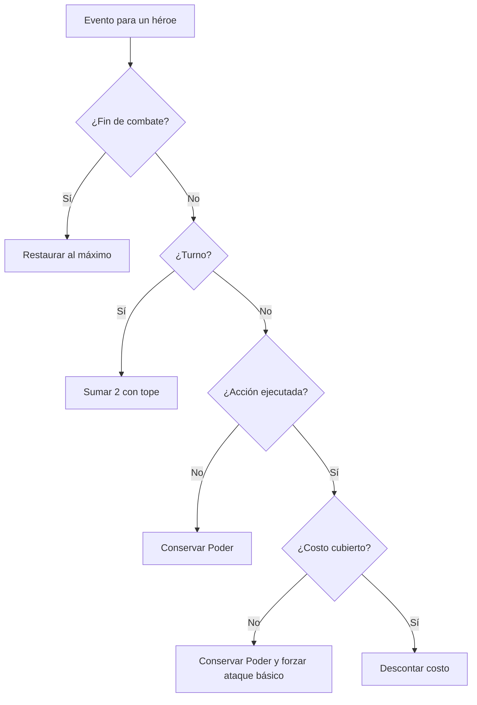
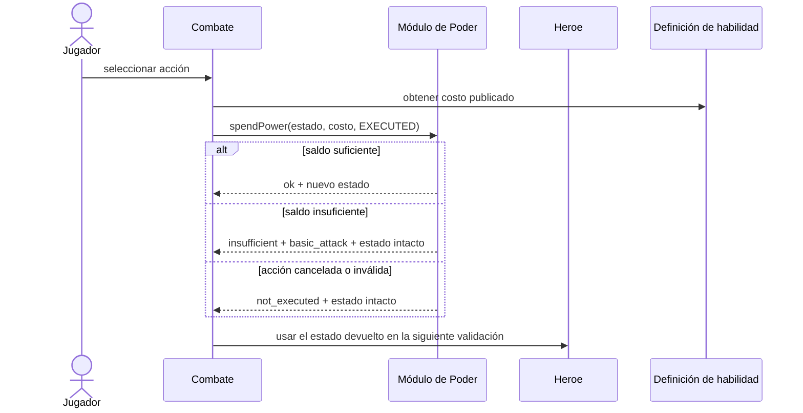
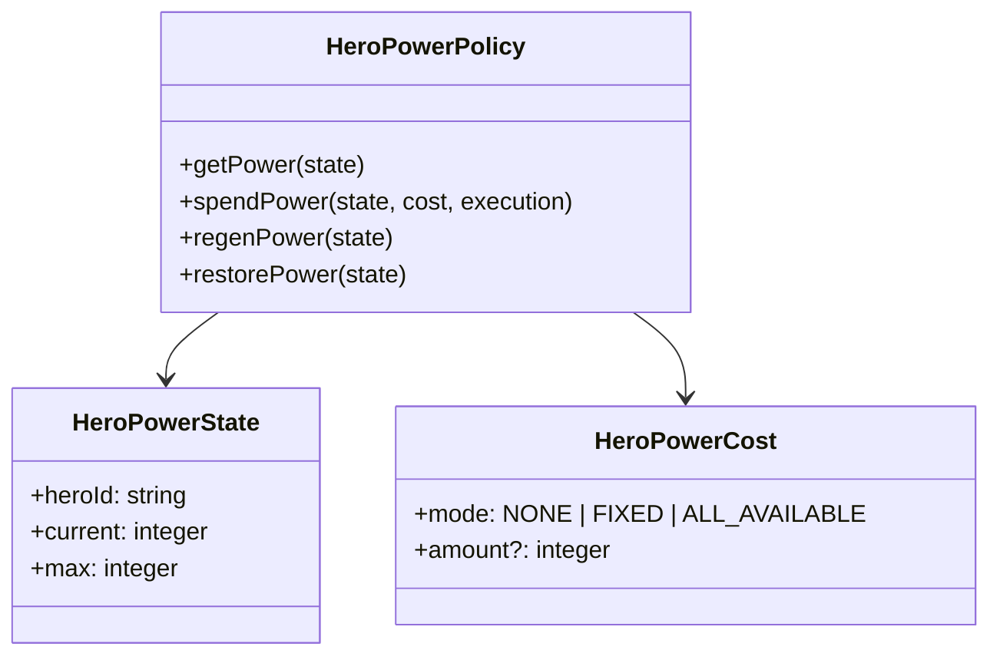

# HU-11 — Gestión del recurso Poder

Trazabilidad: `RF-11` → Management `#20` → Tasks `#234`, `#235` y `#236` →
`HeroPowerPolicy`.

## Decisión de alcance

La regla vive en el dominio del héroe de Player/Inventory. Combate, Misiones y la
interfaz pueden consumirla, pero no deben volver a implementar el gasto, el límite,
la regeneración ni la degradación.

HU-11 no crea un motor de batalla, una sala, una rotación de IA, daño, experiencia,
equipamiento ni un microservicio exclusivo. El instante exacto en que el contexto de
combate emite el turno se mantiene fuera de esta historia.

## Contrato de dominio

- `getPower(state)`: consulta el valor actual después de validar la invariante.
- `spendPower(state, cost, execution)`: consume solo una acción ejecutada.
- `regenPower(state)`: suma exactamente 2 sin superar el máximo.
- `restorePower(state)`: lleva el recurso al máximo al finalizar el combate.

Los costos aceptados corresponden al contrato canónico de Catalog:

- `NONE`: ataque básico, consumo cero.
- `FIXED`: entero positivo publicado por la habilidad.
- `ALL_AVAILABLE`: consume todo el saldo actual, usado por Reanimación.

El máximo no se calcula aquí. Se consume de la definición aprobada del héroe; la
Tabla 6 solo fija los valores de nivel 1 y no define una fórmula de progresión.

## Caso de uso

**Actor:** Jugador o ejecutor de turno del héroe.

**Precondición:** existe un héroe identificado con Poder actual y máximo coherentes.

**Entrada:** estado del héroe, costo publicado y resultado de ejecución de la acción.

**Postcondiciones:**

- una acción válida y pagable produce un estado nuevo con el costo descontado;
- una acción impagable conserva el saldo y selecciona `basic_attack`;
- una acción cancelada o inválida conserva el saldo y no afirma que ocurrió;
- un turno regenera 2 con tope;
- el fin del combate restaura el máximo;
- el estado de otro héroe no cambia.



## Secuencia conceptual



## Modelo



La implementación es funcional e inmutable: no persiste un historial ni mantiene
una bolsa de Poder por jugador. El contexto de combate que introduzca HU-14 será el
responsable de conservar el estado temporal y de emitir turno/fin; HU-11 solo aplica
la regla.

## Compatibilidad con trabajo aprobado

- HU-27 aporta propiedad y selección del héroe.
- HU-28 aporta la vista de estadísticas y el `power` efectivo.
- HU-31 conserva los ocho códigos canónicos de subtipo y su política de épicas.
- Catalog ya soporta `FIXED` y `ALL_AVAILABLE`; HU-11 no crea un segundo catálogo.

## Pruebas y evidencia

`test/unit/hero-power.spec.ts` cubre flujo normal, fronteras y errores: costo exacto,
insuficiencia, ataque básico, `ALL_AVAILABLE`, cancelación, +2 con tope, restauración,
aislamiento, inmutabilidad y entradas inválidas.

El demo local usa los máximos y costos de las Tablas 6 y 7 como datos de demostración,
no como una nueva fuente de producción:

```bash
npm run demo:hu11
```

También se puede ejecutar un recorrido reproducible:

```bash
npm run demo:hu11 -- --commands=1,3,3,t,h8,3,e,q
```

## Decisiones externas pendientes

- HU-14 debe definir qué evento constituye turno y en qué flanco se emite.
- La fórmula de Poder para niveles superiores no está definida; no se inventa.
- El ambiente debe publicar héroes y habilidades reales mediante Catalog.
- La interfaz Web productiva se conecta al contrato real de combate; no usa el demo
  ni una copia local de esta política como autoridad.
