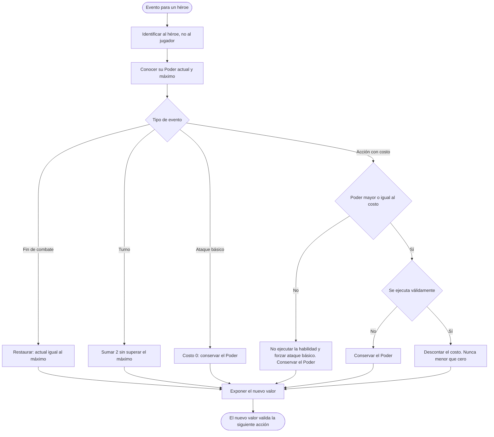
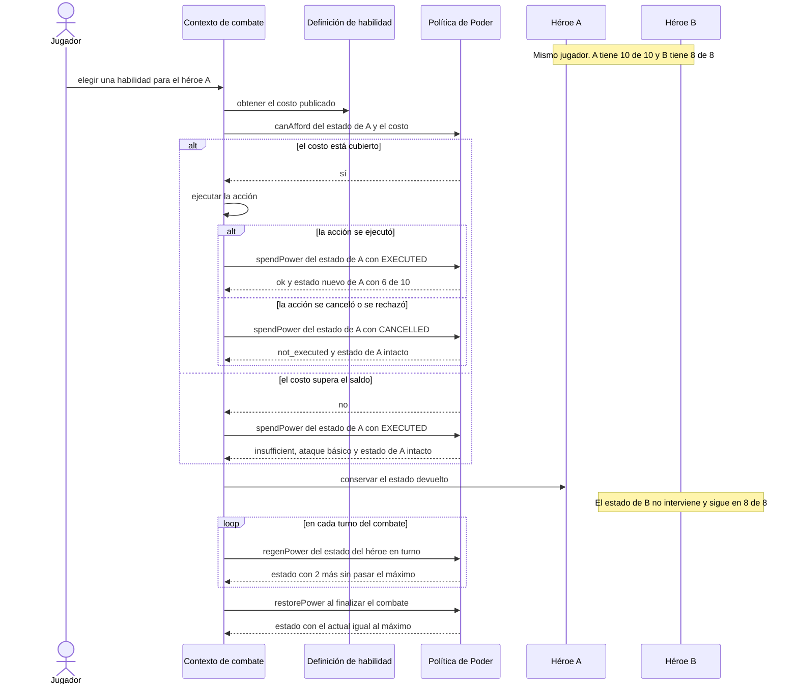
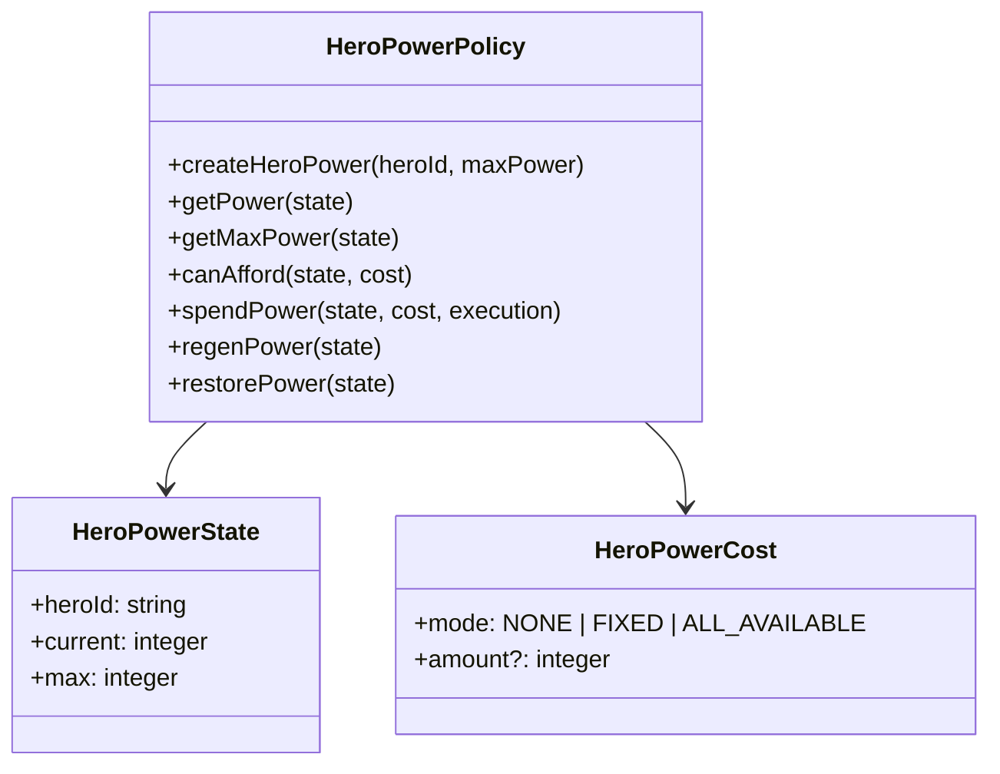

# HU-11 — Gestión del recurso Poder

Trazabilidad: `RF-11` → Management `#20` → Tasks `#234`, `#235` y `#236` →
`HeroPowerPolicy`.

## Qué es el Poder

Recurso del héroe que gastan sus acciones especiales (Tabla 7 del documento oficial
del proyecto). Pertenece **al héroe, no al jugador**: cada héroe lleva su propio Poder
actual y su propio máximo, y el de uno nunca se consume, recupera ni mezcla con el de
otro héroe del mismo jugador.

| Regla de RF-11      | Comportamiento                                                                   |
| ------------------- | -------------------------------------------------------------------------------- |
| Consumo             | Una habilidad ejecutada válidamente descuenta su costo.                          |
| Poder insuficiente  | La habilidad no se ejecuta, el saldo **no cambia** y se fuerza el ataque básico. |
| Ataque básico       | Costo 0: nunca reduce el Poder y siempre se puede usar, incluso con Poder 0.     |
| Acción no ejecutada | Una acción rechazada, cancelada o que no llega a ejecutarse no descuenta nada.   |
| Regeneración        | +2 por turno durante el combate, sin superar el máximo.                          |
| Fin de combate      | Restaura por completo (`actual = máximo`), sea cual sea el saldo.                |
| Límites             | `0 ≤ actual ≤ máximo`, siempre.                                                  |
| Inmediatez          | El estado que devuelve cada operación es el que valida la siguiente acción.      |

## Decisión de alcance

La regla vive en el dominio del héroe de Player/Inventory como una política pura
(`src/domain/policies/HeroPowerPolicy.ts`) y su especificación ejecutable son las
pruebas de este repositorio. No persiste nada, no expone HTTP y no guarda el Poder de
ninguna batalla: el Poder es temporal y se restaura al terminar cada combate.

HU-11 no crea un motor de batalla, una sala, una rotación de IA, daño, experiencia,
equipamiento ni un microservicio exclusivo. El instante exacto en que el contexto de
combate emite el turno se mantiene fuera de esta historia.

El ataque básico interesa aquí solo por su costo 0 y porque sustituye a la habilidad
impagable; su daño, sus dados y su precisión son de Combat. Tampoco se muestra el Poder
al jugador: ver «Decisiones abiertas», punto 10.

Quién conserva el estado durante la actividad es el contexto de Combat, que reimplementa
esta regla con estas pruebas como vectores: ver «Decisiones abiertas», punto 6.

## Contrato de dominio

Todo son funciones puras sobre un estado inmutable
`HeroPowerState { heroId, current, max }`. Ninguna muta su entrada, ninguna guarda
estado entre llamadas y ninguna recibe dos héroes a la vez, así que mezclar el Poder de
dos héroes no es una situación representable.

| Función                                  | Qué hace                                                                            |
| ---------------------------------------- | ----------------------------------------------------------------------------------- |
| `createHeroPower(heroId, maxPower)`      | Estado inicial de un combate: `actual = máximo`. Valida entero, no negativo, héroe. |
| `getPower(state)` / `getMaxPower(state)` | Poder actual y máximo del héroe, tras validar la invariante.                        |
| `canAfford(state, cost)`                 | Pregunta previa **sin consumir**: si el saldo cubre el costo.                       |
| `spendPower(state, cost, execution)`     | Resuelve el consumo una vez conocido el resultado de la acción.                     |
| `regenPower(state)`                      | Suma exactamente `POWER_REGEN_PER_TURN` (2) sin superar el máximo.                  |
| `restorePower(state)`                    | Lleva el Poder al máximo al finalizar el combate.                                   |

`canAfford` existe porque la decisión ocurre **antes** de ejecutar: RF-11 exige conocer
el Poder antes de permitir una acción que lo consuma, y la IA de Misiones evalúa
«disponibilidad de poder suficiente» antes de elegir una rotación. `spendPower` y
`canAfford` comparten la misma regla de pago, así que no pueden discrepar.

### Precedencia de `spendPower`

En este orden:

1. **Acción `CANCELLED` o `INVALID`:** nunca descuenta y no afirma ninguna acción de
   reemplazo (`reason: 'not_executed'`, `fallbackAction: null`), ni siquiera si el costo
   era impagable.
2. **Costo impagable:** la habilidad no se ejecuta, el saldo no cambia y se fuerza el
   ataque básico (`reason: 'insufficient'`, `fallbackAction: 'basic_attack'`).
3. **Costo pagable:** se descuenta exactamente el costo (`ok: true`, `spent`).

## De dónde sale el máximo

El máximo **no se calcula ni se copia aquí**. Es `effectiveStats.power` del héroe:
`basePower` de Catalog más los modificadores permanentes de Poder que su equipamiento
aplica a sí mismo (HU-28). Es el mismo valor que HU-15 entrega a Combat en
`EquippedHeroDto.effectiveStats.power`, y `createHeroPower(heroId, maxPower)` lo recibe
ya resuelto.

La Tabla 6 del documento oficial solo fija los valores de **nivel 1** (Tanque 10,
Armas 8, Fuego 8, Hielo 10, Veneno 8, Machete 8, Chamán 10, Médico 10) y describe el
nivel como «factor multiplicador» sin dar fórmula ni valores para el Poder de niveles
superiores. No se inventa ninguna: este módulo no depende del nivel, solo del máximo
que le entregan.

## Costos

Los costos corresponden al contrato canónico de Catalog. Player/Inventory no resuelve
habilidades (HU-07 solo conserva sus referencias), así que quien las consulta a Catalog
traduce su costo a `HeroPowerCost`:

| Publicado por Catalog                                       | `HeroPowerCost`                |
| ----------------------------------------------------------- | ------------------------------ |
| Ataque básico (sin costo)                                   | `{ mode: 'NONE' }`             |
| Épica V1 (`powerCost: 0`)                                   | `{ mode: 'NONE' }`             |
| Habilidad con `powerCostMode: 'FIXED'` y `powerCost: n ≥ 1` | `{ mode: 'FIXED', amount: n }` |
| Habilidad con `powerCostMode: 'ALL_AVAILABLE'`              | `{ mode: 'ALL_AVAILABLE' }`    |

`FIXED` exige un entero mayor que cero, igual que Catalog (`minimum: 1`): el costo cero
se expresa con `NONE`. `ALL_AVAILABLE` (Reanimación) consume todo el saldo y **requiere
al menos 1 punto**: con saldo 0 no hay nada que consumir y se trata como impagable.

## Caso de uso

- **Identificador:** `UC-HU11-01` — Gestionar el recurso Poder del héroe.
- **Actor:** Jugador o, cuando el combate lo delegue, el ejecutor de turno del héroe.
- **Objetivo:** consultar, consumir y recuperar el Poder de un héroe según RF-11, para que
  las habilidades que dependen de él se validen con un saldo coherente.
- **Precondiciones:** el héroe está identificado; su estado cumple `0 ≤ actual ≤ máximo`;
  el contexto de combate emite los eventos de turno y de fin de combate.
- **Entrada:** estado del héroe (`heroId`, actual, máximo) y un evento: una acción con su
  costo publicado y su resultado de ejecución, un turno, o el fin de combate.
- **Flujo principal (acción con costo):**
  1. El contexto identifica al héroe y toma su estado.
  2. Pregunta `canAfford(estado, costo)`.
  3. Si alcanza, ejecuta la acción.
  4. Informa el resultado a `spendPower`.
  5. La política descuenta el costo y devuelve un estado nuevo.
  6. El contexto conserva ese estado, que valida la siguiente acción.
- **Flujos alternativos:**
  - **A1** Saldo insuficiente: la habilidad no se ejecuta, se fuerza el ataque básico y el
    saldo no cambia.
  - **A2** Acción cancelada, rechazada o no ejecutada: el saldo no cambia y no se afirma
    ninguna acción de reemplazo.
  - **A3** Ataque básico: costo 0, el saldo no cambia.
  - **A4** Turno: `regenPower` suma 2 con tope.
  - **A5** Fin de combate: `restorePower` deja el máximo.
- **Excepciones:** estado inválido (héroe vacío, valores no enteros, actual fuera de
  rango), costo mal formado (modo desconocido, `FIXED` no entero o menor que 1) o
  resultado de ejecución desconocido. Lanzan `DomainError` y no producen ningún efecto.
- **Postcondiciones:** `0 ≤ actual ≤ máximo`; solo cambia el estado del héroe indicado; el
  estado recibido no se muta.
- **Reglas y aceptación:** RF-11 y las restricciones de la HU #20; CA-01, CA-02 y CA-03
  (ver «Trazabilidad de reglas»).
- **Trazabilidad:** RF-11 → HU-11 (#20) → Tasks #234, #235 y #236 → este documento y
  `HeroPowerPolicy`.

Postcondiciones por evento:

- una acción válida y pagable produce un estado nuevo con el costo descontado;
- una acción impagable conserva el saldo y selecciona `basic_attack`;
- una acción cancelada o inválida conserva el saldo y no afirma que ocurrió;
- un turno regenera 2 con tope;
- el fin del combate restaura el máximo;
- el estado de otro héroe no cambia.

## Diagrama de actividades



El caso límite en que un llamador informa como cancelada una acción que además era
impagable lo resuelve `spendPower` por precedencia (ver «Precedencia de `spendPower`»):
no descuenta y no afirma acción de reemplazo.

## Diagrama de secuencia

Los dos héroes son del mismo jugador. La política no guarda estado: el contexto de
combate conserva un estado por héroe y solo pasa a la política el del héroe afectado.



## Modelo



La implementación es funcional e inmutable: no persiste un historial ni mantiene
una bolsa de Poder por jugador. El contexto de combate es quien conserva el estado
temporal por héroe y emite turno/fin; HU-11 solo aplica la regla.

## Impacto arquitectónico y fronteras

- El Poder es un recurso **del héroe**: su regla vive en el dominio de Player/Inventory,
  que ya es la fuente de verdad del héroe y de su equipamiento. No está en el comercio
  electrónico ni se copia en Misiones.
- Consumidores previstos: el contexto de combate (turno y fin de combate), Misiones (la
  misma regla, mediante las simulaciones que pide a Combat según ADR-019) y la interfaz de
  batalla, que muestra el valor. Consumen la regla y no reimplementan el +2 ni los
  límites. Cómo llega la regla a Combat es la decisión abierta 6.
- Fronteras: HU-08 (experiencia) no interviene. HU-28 y HU-29 (equipamiento) solo aportan
  el máximo efectivo, que aquí se lee. HU-31 (efecto épico) conserva los efectos, incluida
  la reducción de Poder al oponente (decisión abierta 4). HU-15 entrega el máximo a Combat.
- No hay endpoint ni persistencia nuevos. El valor actual de un combate lo conserva quien
  lo ejecuta; el máximo se deriva de la definición del héroe y no se guarda.

## Compatibilidad con trabajo aprobado

- HU-27 aporta propiedad y selección del héroe.
- HU-28 aporta la vista de estadísticas y el `power` efectivo, que es el máximo.
- HU-15 entrega ese valor a Combat.
- HU-31 conserva los ocho códigos canónicos de subtipo y su política de épicas.
- Catalog ya soporta `FIXED` y `ALL_AVAILABLE`; HU-11 no crea un segundo catálogo.

## Trazabilidad de reglas

Cada restricción de la HU #20 frente a lo que la cumple y a los bloques de pruebas que la
ejercitan (CA-02). Los bloques están en `test/unit/hero-power.spec.ts`, salvo el último,
que está en `test/unit/hero-power-hero-definition.spec.ts`.

| Regla de la HU #20 / RF-11                                            | Cómo se cumple                                                                               | Bloque de pruebas                                           |
| --------------------------------------------------------------------- | -------------------------------------------------------------------------------------------- | ----------------------------------------------------------- |
| Conocer el Poder disponible antes de permitir una acción que lo gasta | `getPower`, `getMaxPower`, `canAfford`                                                       | consulta del Poder de un héroe concreto; consulta previa    |
| Una habilidad que requiere Poder no se ejecuta si no alcanza          | `spendPower` devuelve `insufficient` y `basic_attack` sin tocar el saldo                     | Poder insuficiente; reanimación                             |
| Al consumir, se descuenta el costo                                    | `spendPower` con `ok: true`                                                                  | consumo válido                                              |
| El ataque básico no reduce el Poder                                   | costo `NONE`                                                                                 | el ataque básico no consume Poder                           |
| Regeneración solo en los momentos y cantidades de las reglas          | `regenPower` (+2 con tope) y `restorePower` (máximo)                                         | regeneración de +2; restauración total                      |
| El valor se mantiene coherente durante toda la batalla                | el estado inmutable que devuelve cada operación                                              | secuencia completa; invariante `0 ≤ actual ≤ máximo`        |
| El Poder es del héroe y no se mezcla con el de otro del mismo jugador | `heroId` dentro del estado; ninguna operación recibe dos héroes                              | aislamiento                                                 |
| Nunca por debajo de cero ni por encima del máximo                     | validación de entrada, `min` en la regeneración, un costo solo se paga si ≤ saldo            | invariante; validación de estados                           |
| Una acción rechazada, cancelada o no ejecutada no descuenta           | `CANCELLED` e `INVALID`                                                                      | acción cancelada, rechazada o no ejecutada                  |
| El nuevo valor valida de inmediato la siguiente acción                | la siguiente operación recibe el estado devuelto por la anterior                             | el nuevo valor se usa de inmediato                          |
| El máximo lo da la definición aprobada del héroe                      | `createHeroPower(heroId, effectiveStats.power)`                                              | el máximo sale de la definición del héroe (segundo archivo) |
| El valor debe mostrarse actualizado al jugador                        | **No se implementa aquí**: lo muestra la interfaz, `PowerMeter` en Web (decisión abierta 10) | —                                                           |

- **CA-01:** Poder actual y costo producen el Poder actualizado, y un costo mayor que el
  saldo bloquea la habilidad y degrada a ataque básico: filas 2 y 3.
- **CA-02:** cada fila tiene al menos un caso positivo, negativo o de frontera.
- **CA-03:** todos los casos derivados pasan (`npm run test:unit` y el CI del PR).

## Pruebas y evidencia

`test/unit/hero-power.spec.ts` cubre, con los números de la HU y sus fronteras:
consulta de actual y máximo; consumo válido (`10 − 4 = 6`, `10 − 10 = 0`); Poder
insuficiente (`3` contra costo `4` conserva `3`, no `0`); ataque básico con `10`, `5`
y `0`; acción cancelada o inválida; regeneración (`0→2`, `2→4`, `8→10`, `10→10`, con
máximos distintos de 10); restauración desde `0`, `2`, `máximo − 1` y `máximo`;
`ALL_AVAILABLE`; inmediatez (tras gastar 4 de 10, un costo 7 se rechaza contra 6); la
secuencia `10 → −4 → +2 → −8 → +2 → fin de combate`; y entradas inválidas.

Además incluye controles que fallarían si la regla fuera falsa:

- **Invariante `0 ≤ actual ≤ máximo`:** 15 000 operaciones mezcladas y deterministas
  (5 máximos distintos, semilla fija) comprueban rango, `heroId`, máximo intacto y la
  aritmética de cada operación.
- **Aislamiento:** la comprobación «gastar 4 en A deja B en 8/8» pasa con un consumidor
  que guarda un estado por héroe y **falla** con un modelo de saldo único por jugador.
  Se prueba también que ninguna operación muta su entrada y que no hay estado de módulo.
- **`canAfford` ≡ `spendPower`:** para todas las combinaciones de saldo y costo, ambos
  coinciden.

`test/unit/hero-power-hero-definition.spec.ts` recorre el camino real Catalog → HU-28 →
HU-15 con dos héroes del mismo jugador: el máximo sale de la definición del héroe, un
ítem que sube el Poder de forma permanente sube el máximo y el tope de regeneración, y
gastar en un héroe no altera al otro.

`test/unit/hero-power.spec.ts` es además el **vector de conformidad de Combat**: se copia en
`test/unit/hero-power-policy.spec.ts` de ese repositorio (Nexus-Battle-Combat#21) y las dos
implementaciones se mantienen alineadas con esos casos. Si cambia la regla o esos casos, hay
que cambiar también la copia de Combat.

El demo local usa los máximos y costos de las Tablas 6 y 7 como datos de demostración,
no como una nueva fuente de producción:

```bash
npm run demo:hu11
```

También se puede ejecutar un recorrido reproducible:

```bash
npm run demo:hu11 -- --commands=1,3,3,t,h8,3,e,q
```

## Decisiones abiertas

Ninguna se decidió por el PO. Las que afectan al código tienen una elección conservadora
y probada que se puede cambiar sin tocar el resto.

1. **Épicas y Poder.** El enunciado de la HU habla de una «habilidad especial o épica»
   que se degrada por Poder insuficiente, pero el documento oficial dice que las épicas
   «no usan puntos de poder» y Catalog las fija en `powerCost: 0`. Con esas reglas una
   épica nunca se degrada por Poder. Si el PO quiere épicas con costo, `FIXED` ya lo
   soporta sin cambios de dominio; habría que cambiar antes el contrato de Catalog.
2. **Reanimación con Poder 0.** La HU no define el borde. Se rechaza y se fuerza el
   ataque básico, por coherencia con «cantidad mínima de poder para su ejecución»;
   ejecutarla gratis sanaría el 100 % de la vida de un aliado sin gastar nada.
3. **Poder inicial.** Un héroe empieza cada combate con el máximo. Se deduce de que el
   fin de cualquier combate restaura por completo; la HU no fija otro valor inicial.
4. **Reducción de Poder por efecto.** La épica «Frío concentrado» y el ítem «Veneno
   lacerante» restan 1 de Poder al oponente. Eso pediría una operación con piso en 0
   que RF-11 no define (solo cubre consumo, +2 y restauración). La definirá quien
   integre esos efectos (HU-19 / HU-31), respetando el mismo rango.
5. **Momento del +2.** La HU dice «+2 por turno» sin precisar si al inicio o al final;
   lo determina el contexto de combate al invocar `regenPower`; los turnos llegan con
   HU-17.
6. **Cómo obtiene Combat la regla.** ADR-019 asigna la batalla —con su Poder— a Combat, y
   Combat no puede importar código de este repositorio (ADR-001, sin paquetes comunes). La
   regla se **reimplementa allí** (`HeroPowerPolicy`, Nexus-Battle-Combat#21) usando estas
   pruebas como vectores de conformidad, a la espera de la revisión de Team Alfa. Este
   módulo sigue siendo la especificación ejecutable: si la regla cambia, cambia en los dos
   repositorios. Falta el agregado de batalla de Combat, que guarde el Poder de cada
   participante y llame a la política.
7. **Fórmula de Poder para niveles superiores.** No está definida; no se inventa.
8. **Datos reales.** El ambiente debe publicar héroes y habilidades reales mediante
   Catalog. La interfaz Web productiva se conecta al contrato real de combate; no usa el
   demo ni una copia local de esta política como autoridad.
9. **Misión frente a combate.** La HU nombra ambos. RF-11 escribe la restauración
   completa para el fin de **combate**, así que no se añade un llenado extra al cerrar
   una misión.
10. **Presentación del Poder.** La HU pide que el valor se muestre actualizado al jugador
    durante la batalla o misión. Cada operación devuelve el estado actualizado, pero este
    servicio no lo muestra ni lo expone por HTTP. El medidor está hecho en la interfaz
    (`PowerMeter`, Nexus-Battle-Web#110): muestra el `{ current, max }` que reciba y se ve
    actualizado en el mismo renderizado. **No está montado en ninguna pantalla**, porque no
    existen el inicio de batalla ni un evento de Combat que lleve el Poder (ADR-020).
