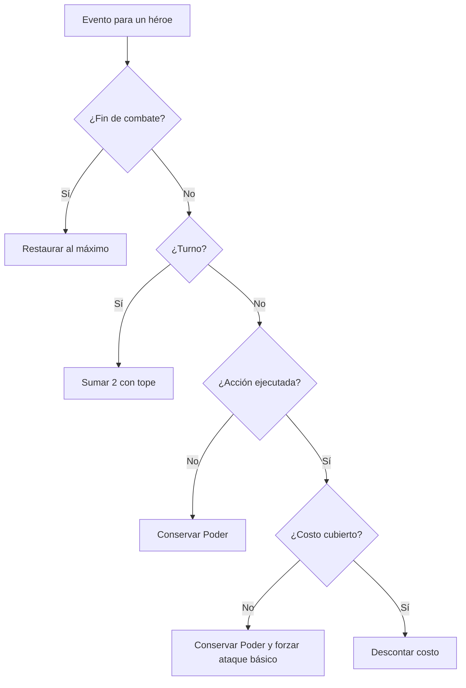
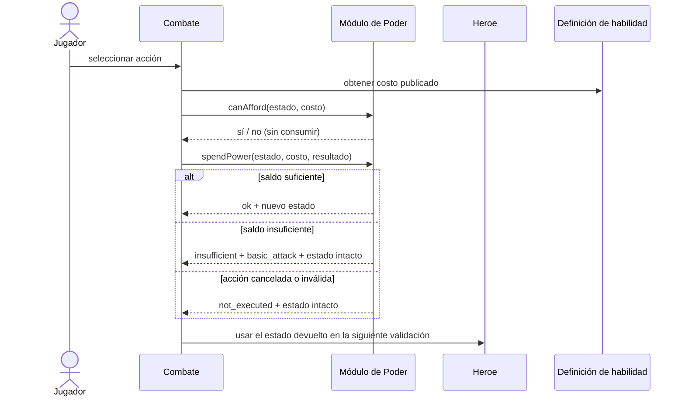
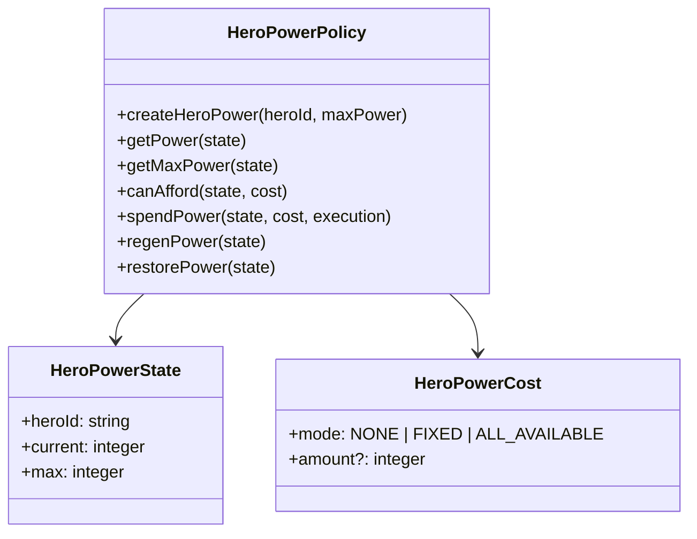

# HU-11 — Gestión del recurso Poder

Trazabilidad: `RF-11` → Management `#20` → Tasks `#234`, `#235` y `#236` →
`HeroPowerPolicy`.

## Qué es el Poder

Recurso del héroe que gastan sus acciones especiales (Tabla 7 del documento oficial
del proyecto). Pertenece **al héroe, no al jugador**: cada héroe lleva su propio Poder
actual y su propio máximo, y el de uno nunca se consume, recupera ni mezcla con el de
otro héroe del mismo jugador.

| Regla de RF-11      | Comportamiento                                                                   |
| ------------------- | -------------------------------------------------------------------------------- |
| Consumo             | Una habilidad ejecutada válidamente descuenta su costo.                          |
| Poder insuficiente  | La habilidad no se ejecuta, el saldo **no cambia** y se fuerza el ataque básico. |
| Ataque básico       | Costo 0: nunca reduce el Poder y siempre se puede usar, incluso con Poder 0.     |
| Acción no ejecutada | Una acción rechazada, cancelada o que no llega a ejecutarse no descuenta nada.   |
| Regeneración        | +2 por turno durante el combate, sin superar el máximo.                          |
| Fin de combate      | Restaura por completo (`actual = máximo`), sea cual sea el saldo.                |
| Límites             | `0 ≤ actual ≤ máximo`, siempre.                                                  |
| Inmediatez          | El estado que devuelve cada operación es el que valida la siguiente acción.      |

## Decisión de alcance

La regla vive en el dominio del héroe de Player/Inventory como una política pura
(`src/domain/policies/HeroPowerPolicy.ts`) y su especificación ejecutable son las
pruebas de este repositorio. No persiste nada, no expone HTTP y no guarda el Poder de
ninguna batalla: el Poder es temporal y se restaura al terminar cada combate.

HU-11 no crea un motor de batalla, una sala, una rotación de IA, daño, experiencia,
equipamiento ni un microservicio exclusivo. El instante exacto en que el contexto de
combate emite el turno se mantiene fuera de esta historia.

Quién conserva el estado durante la actividad y cómo consume esta regla el contexto de
Combat es una decisión abierta: ver «Decisiones abiertas», punto 6.

## Contrato de dominio

Todo son funciones puras sobre un estado inmutable
`HeroPowerState { heroId, current, max }`. Ninguna muta su entrada, ninguna guarda
estado entre llamadas y ninguna recibe dos héroes a la vez, así que mezclar el Poder de
dos héroes no es una situación representable.

| Función                                  | Qué hace                                                                            |
| ---------------------------------------- | ----------------------------------------------------------------------------------- |
| `createHeroPower(heroId, maxPower)`      | Estado inicial de un combate: `actual = máximo`. Valida entero, no negativo, héroe. |
| `getPower(state)` / `getMaxPower(state)` | Poder actual y máximo del héroe, tras validar la invariante.                        |
| `canAfford(state, cost)`                 | Pregunta previa **sin consumir**: si el saldo cubre el costo.                       |
| `spendPower(state, cost, execution)`     | Resuelve el consumo una vez conocido el resultado de la acción.                     |
| `regenPower(state)`                      | Suma exactamente `POWER_REGEN_PER_TURN` (2) sin superar el máximo.                  |
| `restorePower(state)`                    | Lleva el Poder al máximo al finalizar el combate.                                   |

`canAfford` existe porque la decisión ocurre **antes** de ejecutar: RF-11 exige conocer
el Poder antes de permitir una acción que lo consuma, y la IA de Misiones evalúa
«disponibilidad de poder suficiente» antes de elegir una rotación. `spendPower` y
`canAfford` comparten la misma regla de pago, así que no pueden discrepar.

### Precedencia de `spendPower`

En este orden:

1. **Acción `CANCELLED` o `INVALID`:** nunca descuenta y no afirma ninguna acción de
   reemplazo (`reason: 'not_executed'`, `fallbackAction: null`), ni siquiera si el costo
   era impagable.
2. **Costo impagable:** la habilidad no se ejecuta, el saldo no cambia y se fuerza el
   ataque básico (`reason: 'insufficient'`, `fallbackAction: 'basic_attack'`).
3. **Costo pagable:** se descuenta exactamente el costo (`ok: true`, `spent`).

## De dónde sale el máximo

El máximo **no se calcula ni se copia aquí**. Es `effectiveStats.power` del héroe:
`basePower` de Catalog más los modificadores permanentes de Poder que su equipamiento
aplica a sí mismo (HU-28). Es el mismo valor que HU-15 entrega a Combat en
`EquippedHeroDto.effectiveStats.power`, y `createHeroPower(heroId, maxPower)` lo recibe
ya resuelto.

La Tabla 6 del documento oficial solo fija los valores de **nivel 1** (Tanque 10,
Armas 8, Fuego 8, Hielo 10, Veneno 8, Machete 8, Chamán 10, Médico 10) y describe el
nivel como «factor multiplicador» sin dar fórmula ni valores para el Poder de niveles
superiores. No se inventa ninguna: este módulo no depende del nivel, solo del máximo
que le entregan.

## Costos

Los costos corresponden al contrato canónico de Catalog. Player/Inventory no resuelve
habilidades (HU-07 solo conserva sus referencias), así que quien las consulta a Catalog
traduce su costo a `HeroPowerCost`:

| Publicado por Catalog                                       | `HeroPowerCost`                |
| ----------------------------------------------------------- | ------------------------------ |
| Ataque básico (sin costo)                                   | `{ mode: 'NONE' }`             |
| Épica V1 (`powerCost: 0`)                                   | `{ mode: 'NONE' }`             |
| Habilidad con `powerCostMode: 'FIXED'` y `powerCost: n ≥ 1` | `{ mode: 'FIXED', amount: n }` |
| Habilidad con `powerCostMode: 'ALL_AVAILABLE'`              | `{ mode: 'ALL_AVAILABLE' }`    |

`FIXED` exige un entero mayor que cero, igual que Catalog (`minimum: 1`): el costo cero
se expresa con `NONE`. `ALL_AVAILABLE` (Reanimación) consume todo el saldo y **requiere
al menos 1 punto**: con saldo 0 no hay nada que consumir y se trata como impagable.

## Caso de uso

**Actor:** Jugador o ejecutor de turno del héroe.

**Precondición:** existe un héroe identificado con Poder actual y máximo coherentes.

**Entrada:** estado del héroe, costo publicado y resultado de ejecución de la acción.

**Postcondiciones:**

- una acción válida y pagable produce un estado nuevo con el costo descontado;
- una acción impagable conserva el saldo y selecciona `basic_attack`;
- una acción cancelada o inválida conserva el saldo y no afirma que ocurrió;
- un turno regenera 2 con tope;
- el fin del combate restaura el máximo;
- el estado de otro héroe no cambia.



## Secuencia conceptual



## Modelo



La implementación es funcional e inmutable: no persiste un historial ni mantiene
una bolsa de Poder por jugador. El contexto de combate es quien conserva el estado
temporal por héroe y emite turno/fin; HU-11 solo aplica la regla.

## Compatibilidad con trabajo aprobado

- HU-27 aporta propiedad y selección del héroe.
- HU-28 aporta la vista de estadísticas y el `power` efectivo, que es el máximo.
- HU-15 entrega ese valor a Combat.
- HU-31 conserva los ocho códigos canónicos de subtipo y su política de épicas.
- Catalog ya soporta `FIXED` y `ALL_AVAILABLE`; HU-11 no crea un segundo catálogo.

## Pruebas y evidencia

`test/unit/hero-power.spec.ts` cubre, con los números de la HU y sus fronteras:
consulta de actual y máximo; consumo válido (`10 − 4 = 6`, `10 − 10 = 0`); Poder
insuficiente (`3` contra costo `4` conserva `3`, no `0`); ataque básico con `10`, `5`
y `0`; acción cancelada o inválida; regeneración (`0→2`, `2→4`, `8→10`, `10→10`, con
máximos distintos de 10); restauración desde `0`, `2`, `máximo − 1` y `máximo`;
`ALL_AVAILABLE`; inmediatez (tras gastar 4 de 10, un costo 7 se rechaza contra 6); la
secuencia `10 → −4 → +2 → −8 → +2 → fin de combate`; y entradas inválidas.

Además incluye controles que fallarían si la regla fuera falsa:

- **Invariante `0 ≤ actual ≤ máximo`:** 15 000 operaciones mezcladas y deterministas
  (5 máximos distintos, semilla fija) comprueban rango, `heroId`, máximo intacto y la
  aritmética de cada operación.
- **Aislamiento:** la comprobación «gastar 4 en A deja B en 8/8» pasa con un consumidor
  que guarda un estado por héroe y **falla** con un modelo de saldo único por jugador.
  Se prueba también que ninguna operación muta su entrada y que no hay estado de módulo.
- **`canAfford` ≡ `spendPower`:** para todas las combinaciones de saldo y costo, ambos
  coinciden.

`test/unit/hero-power-hero-definition.spec.ts` recorre el camino real Catalog → HU-28 →
HU-15 con dos héroes del mismo jugador: el máximo sale de la definición del héroe, un
ítem que sube el Poder de forma permanente sube el máximo y el tope de regeneración, y
gastar en un héroe no altera al otro.

El demo local usa los máximos y costos de las Tablas 6 y 7 como datos de demostración,
no como una nueva fuente de producción:

```bash
npm run demo:hu11
```

También se puede ejecutar un recorrido reproducible:

```bash
npm run demo:hu11 -- --commands=1,3,3,t,h8,3,e,q
```

## Decisiones abiertas

Ninguna se decidió por el PO; cada una tiene una elección conservadora y probada que se
puede cambiar sin tocar el resto.

1. **Épicas y Poder.** El enunciado de la HU habla de una «habilidad especial o épica»
   que se degrada por Poder insuficiente, pero el documento oficial dice que las épicas
   «no usan puntos de poder» y Catalog las fija en `powerCost: 0`. Con esas reglas una
   épica nunca se degrada por Poder. Si el PO quiere épicas con costo, `FIXED` ya lo
   soporta sin cambios de dominio; habría que cambiar antes el contrato de Catalog.
2. **Reanimación con Poder 0.** La HU no define el borde. Se rechaza y se fuerza el
   ataque básico, por coherencia con «cantidad mínima de poder para su ejecución»;
   ejecutarla gratis sanaría el 100 % de la vida de un aliado sin gastar nada.
3. **Poder inicial.** Un héroe empieza cada combate con el máximo. Se deduce de que el
   fin de cualquier combate restaura por completo; la HU no fija otro valor inicial.
4. **Reducción de Poder por efecto.** La épica «Frío concentrado» y el ítem «Veneno
   lacerante» restan 1 de Poder al oponente. Eso pediría una operación con piso en 0
   que RF-11 no define (solo cubre consumo, +2 y restauración). La definirá quien
   integre esos efectos (HU-19 / HU-31), respetando el mismo rango.
5. **Momento del +2.** La HU dice «+2 por turno» sin precisar si al inicio o al final;
   lo determina el contexto de combate (HU-14) al invocar `regenPower`.
6. **Dónde vive el estado y cómo lo consume Combat.** ADR-019 asigna la batalla —con
   su Poder— a Combat, cuyo README lista HU-11 entre sus historias. Combat es otro
   repositorio y no puede importar código de este (ADR-001, sin paquetes comunes). Este
   módulo es la regla y su especificación ejecutable; falta decidir si Combat la
   reimplementa contra estas pruebas como vectores o si la historia se reubica.
7. **Fórmula de Poder para niveles superiores.** No está definida; no se inventa.
8. **Datos reales.** El ambiente debe publicar héroes y habilidades reales mediante
   Catalog. La interfaz Web productiva se conecta al contrato real de combate; no usa el
   demo ni una copia local de esta política como autoridad.
