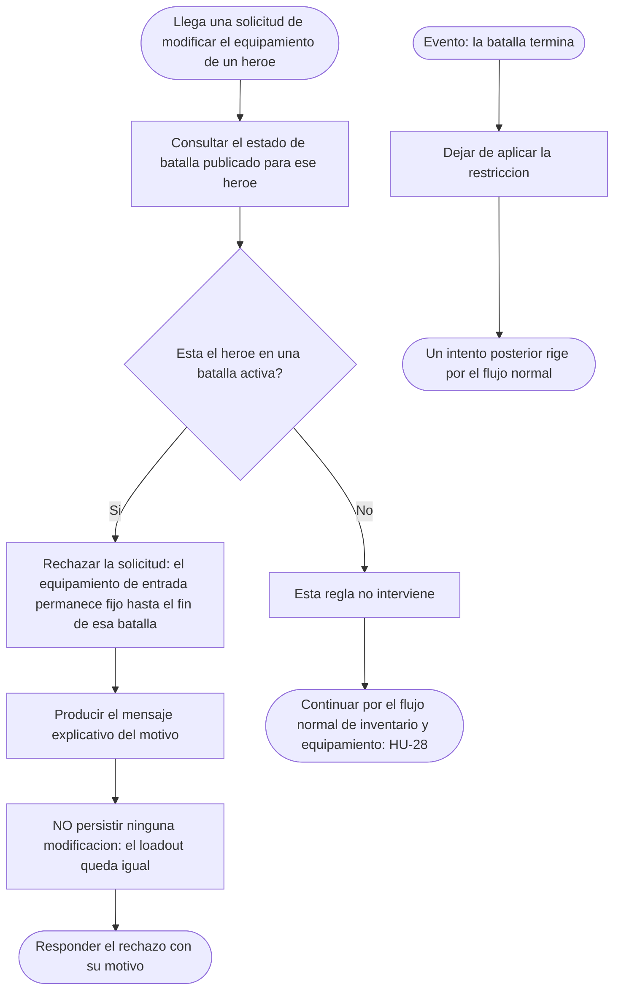
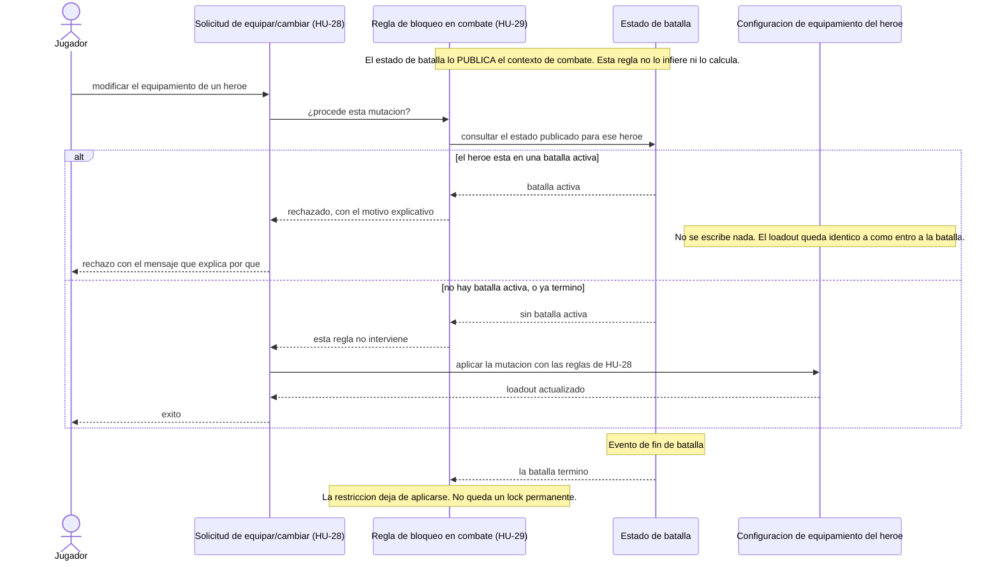
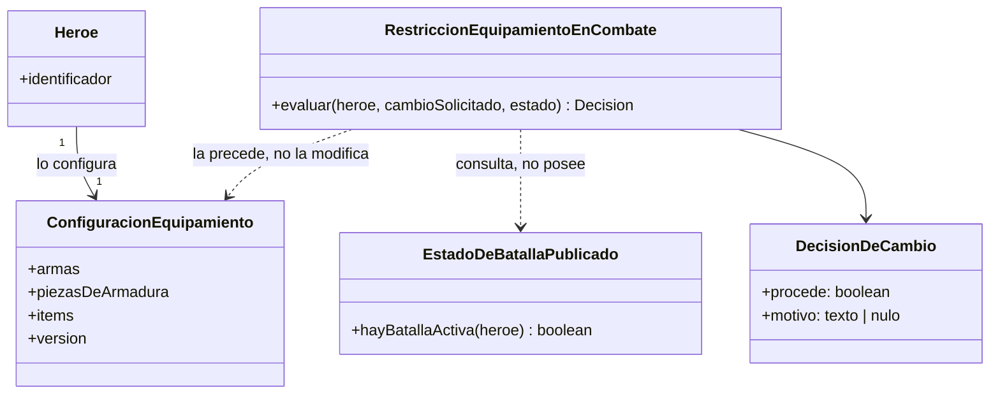

# HU-29 — Bloqueo de cambios de equipamiento durante el combate

Trazabilidad: `RF-29` → HU-29 (`#76`) → Task `#231` (este diseño), `#232`
(implementación), `#233` (pruebas) → este documento.

- **Bounded context:** Player / Inventory
- **Team:** Alfa
- **Story Mapping:** `ACT-02 — Preparar héroe, equipo e inventario` → `Consultar y equipar inventario`
- **Estado de este documento:** **diseño.** No implementa, **no cierra la HU** y **no prescribe
  firmas ni endpoints**, tal como exige la Task `#231`. La implementación es `#232` y las
  pruebas `#233`.

## 1. Qué exige la HU y qué no

**Requisito explícito (`RF-29`, Issue `#76`):** una vez **iniciado** un combate, el
equipamiento con el que el héroe **entró** permanece fijo hasta que esa batalla **termine**.
Todo intento de cambiar **arma**, **pieza de armadura** o **ítem** se **rechaza**, el jugador
recibe un **mensaje que explica por qué**, el equipamiento **no se modifica**, y al finalizar
la batalla la restricción **se libera** y vuelve el flujo normal de inventario.

**Lo que esta HU NO es:**

- **No rediseña el equipamiento.** Las capacidades 2/6/2, el recálculo de estadísticas y la
  validación de propiedad son de HU-28 y se consumen tal cual. El propio caso de uso de HU-28
  lo dejó escrito: _«Este caso de uso es el punto ÚNICO de equipamiento: HU-29 podrá
  anteponerle un guard de estado de batalla sin duplicar el proceso.»_
- **No es un motor de batalla.** No decide cuándo empieza ni cuándo termina un combate: eso es
  del contexto de combate (`#23` HU-14, `#65` HU-21).
- **No es una pantalla.** El mensaje es una decisión de dominio; cómo se presenta es de la
  interfaz.
- **No amplía el alcance a otras categorías.** Cubre arma, armadura e ítem, que es lo que dice
  el contexto de la HU. **No** se inventan mascotas, aspectos ni objetos cosméticos.

### Clasificación de lo decidido

| #   | Tipo                            | Contenido                                                                                                                    |
| --- | ------------------------------- | ---------------------------------------------------------------------------------------------------------------------------- |
| 1   | Requisito explícito             | Arma, armadura e ítem; rechazo; mensaje explicativo; equipo intacto; liberación al terminar                                  |
| 2   | Decisión ya tomada en `ADR-019` | El **compromiso** del héroe vive en Player/Inventory, que absorbe HU-29; y el combate **publica** la batalla activa y su fin |
| 3   | Decisión **pendiente del PO**   | Qué cuenta exactamente como «combate iniciado»; el texto del mensaje                                                         |
| 4   | Fuera de alcance                | Rediseñar 2/6/2, el recálculo, el motor de batalla o la interfaz                                                             |

## 2. Decisión de alcance

El bloqueo **precede** a la operación de equipar; no la sustituye ni la copia. La operación de
equipar sigue siendo la única puerta de escritura del loadout, con su orden estricto
—validar, calcular el estado resultante, persistir de forma consistente, responder— y con la
garantía de que **ningún rechazo deja estado parcial**.

La consecuencia práctica es la que pide `CA-06`: cuando el bloqueo rechaza, **la mutación no
llega a intentarse**. No hay que deshacer nada ni guardar una copia de respaldo, porque nada
cambió.

**El loadout no se clona.** La Task `#231` es explícita: no se crea un snapshot persistente del
equipamiento «salvo que haga falta para demostrar "sin modificaciones"», y **no hace falta**:
la prueba de que el equipo sigue igual es que la escritura nunca ocurrió. Persistir una copia
crearía una segunda versión de la misma verdad, que es justo el riesgo que `HeroSelection`
documenta para su propio caso.

## 3. Caso de uso

- **Identificador:** `UC-HU29-01` — Bloquear cambios de equipamiento durante el combate.
- **Actor principal:** `Jugador`.
- **Inclusiones:** `Rechazar cambio en batalla activa` · `Informar motivo` · `Liberar
restricción al finalizar la batalla`.
- **Objetivo:** impedir que las condiciones de un combate cambien de forma indebida, fijando el
  equipamiento de entrada mientras la batalla está activa.
- **Precondiciones:** el héroe pertenece al jugador; existe una solicitud de modificación de
  equipamiento; el contexto de combate **publica** si ese héroe está en una batalla activa. El
  sistema **no infiere** ese estado: lo recibe.
- **Entrada:** el héroe, el cambio solicitado (una mutación de loadout: equipar, desequipar,
  intercambiar o reemplazar) y el estado de batalla publicado.
- **Flujo principal — batalla activa, la solicitud se rechaza:**
  1. Llega una solicitud de modificar el equipamiento de un héroe.
  2. La regla consulta el estado publicado para ese héroe.
  3. El estado dice **batalla activa**.
  4. La solicitud **se rechaza**.
  5. Se produce un **mensaje explicativo**: el cambio no está permitido **porque** hay una
     batalla activa.
  6. **No se persiste ninguna modificación.** El loadout queda exactamente como estaba.
  7. Se responde el rechazo con su motivo.
- **Flujo alternativo A1 — no hay batalla activa:** la regla **no interviene**. La solicitud
  continúa por el flujo normal de inventario y equipamiento (HU-28), que aplica sus propias
  reglas —propiedad, categoría, capacidad 2/6/2, recálculo— y no las de esta HU.
- **Flujo alternativo A2 — la batalla ya terminó:** es el caso de A1. `CA-07` dice que al
  finalizar **pueden liberarse** las restricciones, así que un intento posterior rige por el
  flujo normal. **No queda un bloqueo permanente.**
- **Excepciones:** la HU no define excepciones propias. Los rechazos de HU-28 (producto no
  propio, categoría equivocada, ranura ocupada, capacidad excedida) siguen ocurriendo **cuando
  la batalla no está activa**; con batalla activa, el rechazo de esta regla los precede y no
  se llega a evaluarlos.
- **Postcondiciones:** o el loadout no cambió y hay un rechazo con motivo, o el estado de
  batalla no estaba activo y esta regla no participó. En ningún caso la regla deja el
  equipamiento en un estado intermedio.
- **Reglas y aceptación:** `RF-29` y las restricciones de `#76`; `CA-01` a `CA-08`.
- **Trazabilidad:** `RF-29` → HU-29 (`#76`) → Tasks `#231`, `#232`, `#233` → este documento.

## 4. Diagrama de actividades

Las tres inclusiones del caso de uso se ven en el diagrama: **rechazar** (nodo D),
**informar** (nodo E) y **liberar** (rama del evento de fin). La rama `No` no aplica HU-29 y
deja el trabajo a HU-28, que es lo que exige `CA-07`.

**Lo que el diagrama NO modela, y es deliberado:** el recálculo de estadísticas, que es de HU-28
cuando el cambio **sí** se permite; y el ciclo de vida de la sala, que es del contexto de
combate. Aquí solo aparece el **evento** «la batalla termina», sin decidir cómo se detecta.

## 5. Diagrama de secuencia

El fragmento `alt` cubre los dos caminos que la Task pide representar. La parte de HU-28
—propiedad, categoría, ranura, capacidad, recálculo— aparece **como una sola caja**, no
desglosada: esta HU la precede, no la reimplementa.

## 6. Modelo

Los tres conceptos mínimos que pide la Task:

| Concepto                                 | Qué es                                                                                                         | De quién es                         |
| ---------------------------------------- | -------------------------------------------------------------------------------------------------------------- | ----------------------------------- |
| `Heroe` y su `ConfiguracionEquipamiento` | El héroe y su loadout. **Se consumen de HU-28; no se rediseñan**                                               | Player / Inventory (HU-28)          |
| `EstadoDeBatallaPublicado`               | Un **estado**, no el motor. Responde si un héroe está en batalla activa. La regla **lo consulta, no lo posee** | Contexto de combate, que lo publica |
| `RestriccionEquipamientoEnCombate`       | La regla temporal: decide si una mutación procede mientras la batalla está activa                              | Player / Inventory (esta HU)        |

### Alternativas rechazadas

- **Un snapshot persistente del loadout.** Se evaluó guardar una copia del equipamiento de
  entrada para poder demostrar «sin modificaciones» y **se rechaza**: si la mutación no se
  aplica, la copia no demuestra nada que el propio loadout no demuestre, y crea una segunda
  versión de la verdad que puede desincronizarse. La Task lo pide expresamente.
- **Un `MensajeHardcodeado` como concepto de dominio.** Se rechaza: el mensaje es la
  **consecuencia** de la decisión, no una entidad. Modelarlo como concepto invitaría a fijar el
  copy, que está pendiente.
- **Un `MotorDeBatalla` o un `Inventario` nuevo.** Se rechazan: pertenecen a otros contextos y
  a HU-27/HU-28.

## 7. Contrato conceptual

En términos de **dominio**, sobre la operación de cambio de equipo. **No hay HTTP y no se
prescriben firmas**: la Task lo prohíbe de forma expresa, y el transporte que finalmente se use
es una decisión de implementación que `ADR-019` ya enmarca (el combate **publica** el
compromiso del héroe al iniciar y su liberación al terminar).

| Aspecto                        | Definición                                                                                                                                 |
| ------------------------------ | ------------------------------------------------------------------------------------------------------------------------------------------ |
| **Entrada**                    | El héroe, el cambio solicitado y el contexto de batalla                                                                                    |
| **Si hay batalla activa**      | Resultado **rechazado**, con un **mensaje explicativo**, y el equipo **inalterado**                                                        |
| **Si no hay batalla activa**   | Esta regla **no interviene**: la solicitud sigue por el flujo normal                                                                       |
| **Qué se considera un cambio** | **Cualquier** mutación del loadout: equipar, desequipar, intercambiar o reemplazar. No hay excepciones por categoría ni por tipo de objeto |
| **Categorías cubiertas**       | **Arma, armadura e ítem.** Las tres por igual: la categoría no cambia la decisión                                                          |
| **Momento de la comprobación** | **Antes** de leer o mutar el loadout. Nunca después de aplicar el cambio                                                                   |
| **Efectos sobre los datos**    | Ninguno. No se escribe, no se emite un evento de cambio y no se publica nada                                                               |
| **Idempotencia**               | Total: dos intentos seguidos en batalla activa producen dos rechazos y **cero cambios acumulados**                                         |
| **Al terminar la batalla**     | La restricción **deja de aplicarse**. No queda un lock permanente                                                                          |

## 8. Impacto arquitectónico

- **Dónde vive el bloqueo.** Junto al caso de uso de equipar, en Player/Inventory, que ya es la
  fuente de verdad del héroe y de su equipamiento. **No** en el comercio electrónico y **no** en
  el recurso Poder (HU-11), que no toca el loadout.
- **Quién publica el estado.** El **contexto de combate** publica «batalla activa» y «fin de
  batalla». No es una responsabilidad de esta HU ni de Player/Inventory, y por eso el diseño lo
  modela como un **estado que se recibe**, no como algo que se calcula.
- **Quién decide el rechazo.** **Una sola vez**, en la regla de dominio. La interfaz **no**
  reimplementa el rechazo: presenta el mensaje que el dominio produjo. El PR de Web de esta HU
  ya lo dejó escrito en su alcance —_«no decide en React si hay una batalla activa»_— y esa
  frontera se mantiene.
- **Sin lock permanente.** El estado de batalla activa es **temporal por definición**: al
  terminar la batalla, la regla deja de aplicar. No hay que «desbloquear» nada, porque no hay
  nada bloqueado: hay una condición que se cumple mientras dure la batalla.
- **`ADR-019` ya enmarca la integración.** Asigna a Player/Inventory los **compromisos** del
  héroe (`BATTLE`, `MISSION`, `AUCTION`, `TOURNAMENT`) y decide que Combat publica el compromiso
  **al iniciar** y lo **libera al terminar**. Este diseño **no reabre** esa decisión: modela el
  estado y su liberación, y deja el transporte a la implementación.

### Fronteras con otras historias

| HU                         | Relación                                                                                                                                                                                                                                                                                                                                                                                                                                                                                                                                                                                                                                                                                                                                                  |
| -------------------------- | --------------------------------------------------------------------------------------------------------------------------------------------------------------------------------------------------------------------------------------------------------------------------------------------------------------------------------------------------------------------------------------------------------------------------------------------------------------------------------------------------------------------------------------------------------------------------------------------------------------------------------------------------------------------------------------------------------------------------------------------------------- |
| **HU-28** (`#75`, cerrada) | Aporta la operación de equipar, las capacidades 2/6/2 y el recálculo. HU-29 la **precede**, no la duplica                                                                                                                                                                                                                                                                                                                                                                                                                                                                                                                                                                                                                                                 |
| **HU-14** (`#23`, cerrada) | Creación de la sala. Figura como bloqueo declarado del issue; su contenido **no se inventa aquí**                                                                                                                                                                                                                                                                                                                                                                                                                                                                                                                                                                                                                                                         |
| **HU-21** (`#65`, cerrada) | Finalización de la batalla. Es quien produce el **fin** que libera la restricción                                                                                                                                                                                                                                                                                                                                                                                                                                                                                                                                                                                                                                                                         |
| **HU-11** (Poder)          | **No interviene.** El Poder no es equipamiento                                                                                                                                                                                                                                                                                                                                                                                                                                                                                                                                                                                                                                                                                                            |
| **HU-31** (efecto épico)   | **No interviene.** La épica no es una categoría de loadout en HU-28, y la HU de bloqueo no la menciona                                                                                                                                                                                                                                                                                                                                                                                                                                                                                                                                                                                                                                                    |
| **HU-07** (`#16`, cerrada) | Dejó su propio `CA-09` fuera de alcance remitiendo aquí: _«la regla de modificación durante combate … pertenece a HU-29 y actualmente existe una inconsistencia documental que debe ser resuelta antes de automatizar dicho comportamiento como requisito definitivo»_. **Qué se resuelve aquí y qué no:** la **inconsistencia documental** está resuelta —el body de la Task `#231` reescribió el molde y convirtió lo que estaba implícito en **seis decisiones declaradas**, en lugar de dejarlas a la interpretación—; lo que **sigue abierto** es la **decisión funcional** (sección 11). Por eso este diseño **no automatiza** ningún comportamiento de equipamiento y **no toca HU-07**: la puerta de escritura sigue siendo una sola, la de HU-28 |

## 9. Trazabilidad de reglas

| Restricción de `#76` / `RF-29`                                            | Cómo se cumple                                                                  | Escenario |
| ------------------------------------------------------------------------- | ------------------------------------------------------------------------------- | --------- |
| El equipamiento de entrada permanece fijo hasta el fin de **esa** batalla | La regla precede toda mutación mientras el estado publicado diga batalla activa | 1, 2, 3   |
| Una vez iniciado el combate, no se cambian **armas**                      | Cubierto: la categoría no altera la decisión                                    | 1         |
| Una vez iniciado el combate, no se cambian **piezas de armadura**         | Cubierto: la categoría no altera la decisión                                    | 2         |
| Ante un intento en batalla activa, el sistema **rechaza**                 | El rechazo precede a la lectura y a la mutación                                 | 1, 2, 3   |
| El jugador recibe un **mensaje que explica por qué**                      | El rechazo produce un motivo explicativo; el copy exacto está pendiente         | 1, 2, 3   |
| El equipamiento **permanece sin modificaciones**                          | La mutación no se aplica; no hay estado parcial ni copia que restaurar          | 1, 2, 3   |
| Al finalizar la batalla se **liberan** las restricciones                  | La regla deja de aplicar cuando el estado deja de decir batalla activa          | 4         |
| Un criterio obligatorio fallido impide aceptar la HU (`CA-08`)            | Tabla de evidencia, **sin declarar la HU aceptada**                             | —         |

### Criterios de aceptación

| CA        | Enunciado                                                                  | Dónde se cubre                                          |
| --------- | -------------------------------------------------------------------------- | ------------------------------------------------------- |
| **CA-01** | Intento en batalla activa → rechazo con mensaje, equipo sin modificaciones | Flujo principal del caso de uso; escenarios 1, 2, 3     |
| **CA-02** | No se permiten cambios de **armas**                                        | Escenario 1                                             |
| **CA-03** | No se permiten cambios de **piezas de armadura**                           | Escenario 2                                             |
| **CA-04** | Ante un intento en batalla activa, se **rechaza**                          | Flujo principal; escenarios 1, 2, 3                     |
| **CA-05** | El jugador recibe un **mensaje explicativo**                               | Paso 5 del flujo principal; inclusión `Informar motivo` |
| **CA-06** | El equipamiento **permanece sin modificaciones**                           | Paso 6; escenario 5 (dos intentos, cero cambios)        |
| **CA-07** | Al finalizar, las restricciones **pueden liberarse**                       | Flujo alternativo A2; escenario 4                       |
| **CA-08** | Un criterio obligatorio fallido impide aceptar la HU                       | Condición de aceptación, no un escenario                |

## 10. Escenarios de prueba (para `#233`)

Los cinco que la Task `#231` deja identificados:

| #   | Escenario                                       | Resultado esperado                                               |
| --- | ----------------------------------------------- | ---------------------------------------------------------------- |
| 1   | Cambiar **arma** en batalla activa              | Rechazo, mensaje explicativo, loadout idéntico                   |
| 2   | Cambiar **pieza de armadura** en batalla activa | Rechazo, mensaje explicativo, loadout idéntico                   |
| 3   | Cambiar **ítem** en batalla activa              | Rechazo, mensaje explicativo, loadout idéntico                   |
| 4   | El mismo intento con la batalla **terminada**   | HU-29 **no** bloquea: rige el flujo normal de inventario y HU-28 |
| 5   | **Dos intentos seguidos** en batalla activa     | Dos rechazos y **ningún cambio acumulado**                       |

Escenarios adicionales que se derivan de las reglas y conviene cubrir en `#233`:

| #   | Escenario                                                   | Resultado esperado                                   |
| --- | ----------------------------------------------------------- | ---------------------------------------------------- |
| 6   | **Desequipar** en batalla activa                            | Rechazo: es una mutación del loadout                 |
| 7   | **Intercambiar** dos piezas entre ranuras en batalla activa | Rechazo                                              |
| 8   | Cambio **fuera** de batalla                                 | HU-29 no interviene; las reglas de HU-28 sí          |
| 9   | Batalla activa y, además, una regla de HU-28 incumplida     | Prevalece el rechazo del bloqueo; no se evalúa HU-28 |
| 10  | Rechazo y después fin de batalla: el mismo cambio           | Ahora sí procede por el flujo normal                 |

## 11. Decisiones abiertas

Ninguna la ha decidido el Product Owner. Se dejan **explícitas** en lugar de inventarlas, como
exige la Task.

1. **Qué cuenta como «combate iniciado» / «batalla activa».** No está el criterio de borde
   —cuenta atrás, primer turno, sala creada—. Este diseño modela un **estado** que el contexto
   de combate publica, y **no** inventa el ciclo de vida de la sala. Lo que sí puede decirse con
   la evidencia disponible es que el contrato de HU-21 define los estados
   `WAITING_FOR_PLAYERS`, `PREPARING`, `IN_BATTLE`, `FINISHED` y `CANCELLED`, y que la lectura
   **literal** de la HU —«una vez iniciado un combate»— apunta a **`IN_BATTLE`**. **Ampliar el
   bloqueo a `PREPARING` rompería el lobby de preparación de HU-15.3**, donde el jugador equipa
   a propósito, así que no se hace sin decisión expresa.
2. **Texto exacto del mensaje.** Se modela que es **explicativo** —el cambio no está permitido
   **porque** hay una batalla activa—, pero **no se fija el copy**. Fijarlo aquí sería inventar
   producto.
3. **`HU-014`.** Se cita como bloqueo declarado del issue. **Su contenido no se inventa aquí**,
   y la implementación no se da por desbloqueada mientras no esté disponible. Nota de estado:
   el issue `#23` figura `closed`, pero este diseño no reinterpreta ese bloqueo.
4. **Si la épica debe entrar en el bloqueo.** La HU textual nombra **arma, armadura e ítem**, y
   **no menciona la épica**. Además, `HU-28` excluye explícitamente `EPICA` de las categorías
   equipables. **No se amplía el alcance** sin una decisión formal.
5. **La señal de liberación al terminar.** Este diseño modela el **evento**, no su transporte.
   `ADR-019` ya decidió que Combat publica la liberación al terminar; **cómo** llega es
   implementación de `#232`.

## 12. Qué NO hace este diseño

Se enumera porque la Task lo prohíbe de forma expresa, y porque son los riesgos que ella misma
declara:

- **No prescribe endpoints ni firmas.** Nada de `lockLoadout()`, `EquipmentLockService` ni un
  contrato HTTP. El servicio del que habla la Task es el de **dominio**.
- **No prescribe la forma del rechazo en código.** No se escribe `if (inBattle) throw`.
- **No reimplementa las capacidades 2/6/2** ni el recálculo de estadísticas de HU-28.
- **No bloquea el inventario fuera de la batalla.** Un intento fuera de batalla rige por el
  flujo normal.
- **No inventa el copy** ni el ciclo de vida de la sala.
- **No persiste un clon del loadout** como segunda verdad.
- **No define HU-14** ni la da por resuelta.
- **No toca la épica**, que es de HU-31 y no es categoría equipable en HU-28.
