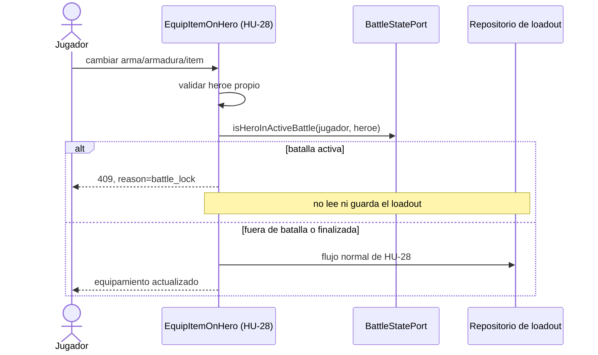

# HU-29 — Bloqueo de equipamiento durante el combate

Trazabilidad: `RF-29` → `HU-29` / Management `#76` → guard en
`EquipItemOnHero` (HU-28).

## Regla implementada

Armas, armaduras e items pasan por el mismo caso de uso de HU-28. Despues de
comprobar que el heroe pertenece al jugador y antes de leer el producto o el
loadout, el caso de uso consulta `BattleStatePort`:



El error HTTP conserva una razon estable para la interfaz:

```json
{
  "reason": "battle_lock",
  "message": "No se puede modificar el equipamiento porque el heroe participa en una batalla activa."
}
```

La verificacion ocurre despues de resolver el heroe propio: un jugador no puede
usar este endpoint para averiguar si un heroe ajeno esta en combate. Un rechazo
no crea ni modifica el agregado `HeroLoadout`.

## Dependencia pendiente de HU-14

Este repositorio no es dueno del ciclo de vida de una batalla y no crea un
microservicio, un endpoint interno ni estados nuevos para simularlo. El puerto
de salida esta conectado temporalmente a `InMemoryBattleStateRegistry`, que
permite ejecutar y probar el flujo completo y expone las dos transiciones
minimas `markBattleStarted` / `markBattleFinished`.

Antes de promover esta historia a produccion, HU-14 debe publicar el contrato
real de inicio/fin de batalla y la composicion debe sustituir el registro en
memoria por ese adaptador. Hasta entonces el PR debe permanecer en borrador:
reiniciar el proceso elimina el registro y ninguna fuente externa lo alimenta.

## Cobertura de aceptacion

- La politica pura prueba las tres familias: arma, armadura e item.
- El caso de uso prueba que durante la batalla no se crea el loadout.
- La API prueba `409` + `battle_lock`, lectura posterior intacta y liberacion al
  finalizar la batalla.
- Las pruebas existentes de HU-28 y HU-31 siguen siendo regresion obligatoria.
