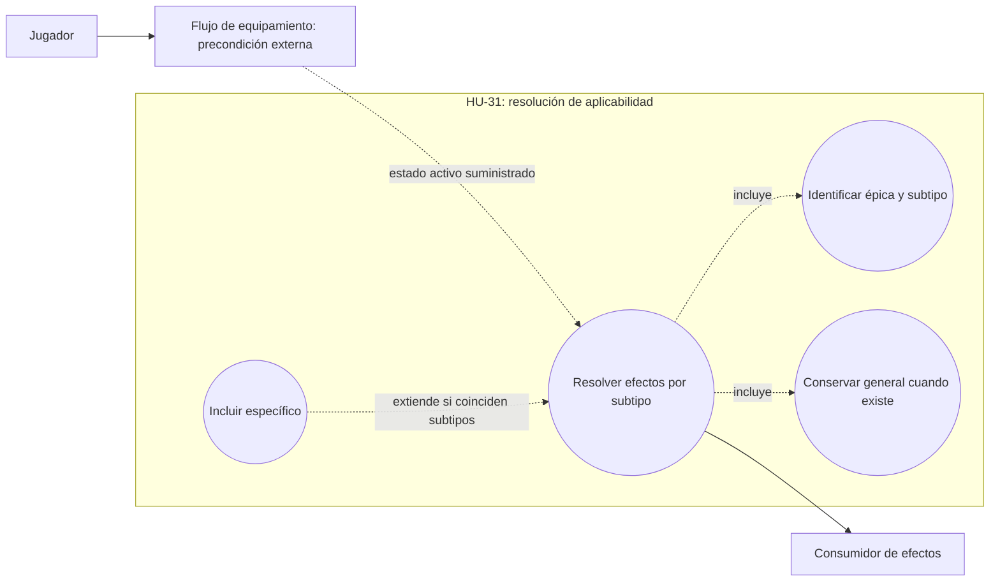
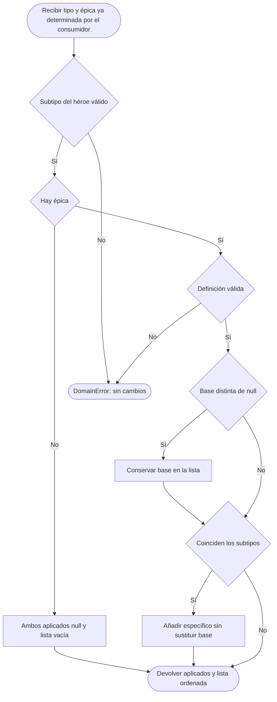
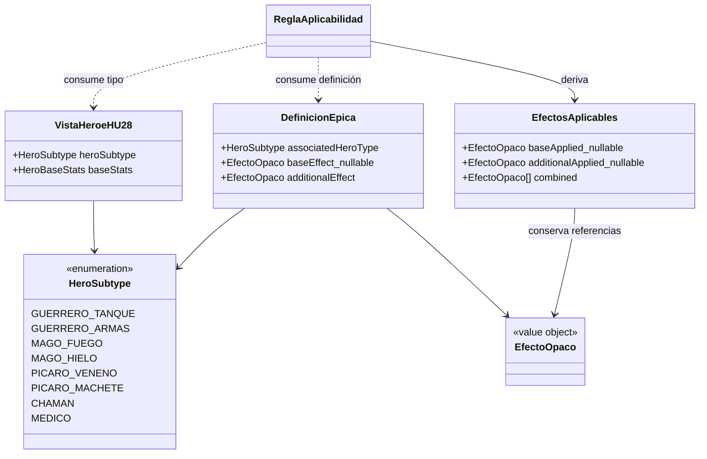

# HU-31 — Efecto de habilidad épica según subtipo de héroe

Esta entrega implementa la resolución de efectos de RF-31 en el dominio de
Player/Inventory. Recibe el subtipo del héroe y una definición de épica; conserva
el efecto general cuando existe y añade el específico únicamente al coincidir
los subtipos. Los resultados son datos derivados, sin ejecutar combate ni
modificar estadísticas base.

Trazabilidad: [HU-31 / RF-31](https://github.com/Nexus-Battle-VI/Nexus-Battle-Management/issues/78),
[diseño #206](https://github.com/Nexus-Battle-VI/Nexus-Battle-Management/issues/206),
[implementación #207](https://github.com/Nexus-Battle-VI/Nexus-Battle-Management/issues/207)
y [pruebas #208](https://github.com/Nexus-Battle-VI/Nexus-Battle-Management/issues/208).

## Fuentes y precisión funcional vigente

El diseño incorpora la
[corrección funcional de HU-31.1, comentario 5440869020](https://github.com/Nexus-Battle-VI/Nexus-Battle-Management/issues/206#issuecomment-5440869020).
Ese comentario precisa dos puntos de los bodies anteriores:

- La coincidencia compara ocho **subtipos**, no las familias `guerrero`, `mago`
  o `pícaro`.
- `baseEffect: null` es válido y significa «No aplica». Omitir esa propiedad en
  el contrato del resolver sigue siendo inválido. Té changua y Reanimador 3000
  tienen base nula.

La fuente de datos es `Proyecto integrador II 2 (1).md`, apartado 6.1.2,
Tabla 20, «Habilidades Épicas de los Héroes» (página 31 del documento original).

El vocabulario implementado reutiliza
[`HERO_SUBTYPES`](../src/domain/value-objects/hero-subtype.ts) de HU-28. Su origen es
el [registro aprobado `hero-subtypes-v1`](https://github.com/Nexus-Battle-VI/Nexus-Battle-Infrastructure/blob/4d3d5e80073f5a7fbaaf19eb8fe8da2c91f33f08/docs/contracts/catalog/hero-subtypes-v1.yaml).
Los nombres de presentación de la tabla se traducen a esos códigos; el resolver
no infiere un subtipo a partir de una familia o nombre libre.

| Código canónico   | Épica de Tabla 20       | Efecto general          | Efecto específico del subtipo                                             |
| ----------------- | ----------------------- | ----------------------- | ------------------------------------------------------------------------- |
| `GUERRERO_TANQUE` | Golpe de defensa        | +1 al ataque            | +4 al daño y +2 % de crítico                                              |
| `GUERRERO_ARMAS`  | Segundo impulso         | Recupera 1d4 de vida    | +3 a la vida y +5 % de crítico                                            |
| `MAGO_FUEGO`      | Luz cegadora            | +1 a la vida            | +2 al daño y +1 % de crítico                                              |
| `MAGO_HIELO`      | Frio concentrado        | −1 de poder al oponente | No recibe daño en el siguiente turno                                      |
| `PICARO_VENENO`   | Toma y lleva            | +1 al ataque            | Reduce a la mitad el daño causado por el oponente y se lo retorna         |
| `PICARO_MACHETE`  | Intimidación sangrienta | +1 al daño              | +2 a la vida y +2 % de crítico                                            |
| `CHAMAN`          | Té changua              | No aplica (`null`)      | Sana a todos con 4d8                                                      |
| `MEDICO`          | Reanimador 3000         | No aplica (`null`)      | Se vincula a un compañero; si fallece, lo reanima con el 20 % de su salud |

La tabla documenta las definiciones de origen. No decide si un aumento de vida
altera vida actual o máxima, cómo acumular modificadores, cuándo ejecutar dados,
ni qué unidades exactas alcanza «todos». Las
[`fixtures` de Tabla 20](../test/fixtures/epic-table20.ts) son objetos opacos para
probar que se conserva la definición; **no son payloads del API de Catalog**.

## Caso de uso textual: CU-HU-31

**Nombre:** Resolver efectos de habilidad épica según subtipo de héroe.

**Actor:** Jugador, a través del flujo que configura su héroe. La función de
dominio no autentica al actor.

**Disparador:** el consumidor solicita los efectos de la épica que ya conoce
como activa o equipada.

**Precondiciones de integración:** el consumidor ha comprobado pertenencia del
héroe y la épica, elegibilidad y estado activo. HU-31 no obtiene esas garantías
por recibir una referencia de producto. El subtipo y las definiciones provienen
de los contratos oficiales.

**Entrada:** subtipo canónico del héroe y definición de épica, o ausencia de
épica. La definición contiene subtipo asociado, efecto general nullable y efecto
específico obligatorio.

**Flujo principal, coincidencia con base:**

1. Validar que el subtipo del héroe pertenezca al registro vigente.
2. Si hay épica, validar subtipo asociado, presencia explícita de base y efecto
   específico como objeto.
3. Conservar el efecto general.
4. Comprobar la coincidencia exacta de subtipos.
5. Añadir el específico después del general.
6. Devolver ambos efectos sin ejecutarlos ni mutar las entradas.

**Alternativas y excepciones:**

| Escenario                                    | Resultado                               |
| -------------------------------------------- | --------------------------------------- |
| Sin épica (`null`, omitida o `undefined`)    | Ambos aplicados en `null`, lista vacía  |
| Sin coincidencia y con base                  | Solo base                               |
| Coincidencia y base nula                     | Solo específico                         |
| Sin coincidencia y base nula                 | Lista vacía                             |
| Subtipo del héroe ausente, vacío o inválido  | `DomainError`, incluso si no hay épica  |
| Subtipo asociado inválido o ausente          | `DomainError`                           |
| Base omitida o `undefined`                   | `DomainError`; no equivale a `null`     |
| Específico ausente, nulo o de forma inválida | `DomainError`, también sin coincidencia |

**Postcondición:** se devuelve un resultado nuevo con una lista nueva de
referencias a los efectos seleccionados. Los objetos de efecto conservan su
identidad y contenido; el consumidor debe tratarlos como solo lectura. No se
cambia el inventario, el loadout, las estadísticas ni la persistencia.

## Diagramas de diseño editables — Task HU-31.1

Los diagramas distinguen la resolución implementada de la precondición de
equipamiento. La flecha desde HU-28 expresa el contrato de integración esperado;
no prueba que HU-28 ya persista una épica activa.

### Casos de uso



### Actividades



### Secuencia

```mermaid
sequenceDiagram
    actor Jugador
    participant Equipar as Consumidor del estado equipado
    participant Heroe as Vista oficial del héroe HU-28
    participant Epica as Definición de habilidad épica
    participant Regla as Regla de efecto por subtipo HU-31
    Note over Equipar,Epica: El origen de la épica activa sigue pendiente en HU-28
    Jugador->>Equipar: Consultar configuración y efectos
    Equipar->>Heroe: Obtener subtipo validado
    Heroe-->>Equipar: Subtipo
    alt Sin épica activa
        Equipar->>Regla: Subtipo y ausencia de épica
        Regla-->>Equipar: null, null, lista vacía
    else Con épica activa
        Equipar->>Epica: Obtener definición general y específica
        Epica-->>Equipar: Subtipo asociado, base nullable, específico
        Equipar->>Regla: Subtipo y definición
        Regla->>Regla: Validar; conservar base si existe
        alt Coincidencia de subtipos
            Regla->>Regla: Añadir específico después de base
            Regla-->>Equipar: Base y específico, o específico si base null
        else Sin coincidencia
            Regla-->>Equipar: Solo base, o lista vacía si base null
        end
    end
    Note over Regla: Sin ejecutar efectos ni modificar estadísticas
    Equipar-->>Jugador: Efectos aplicables a presentar por el consumidor
```

### Dominio / clases conceptuales



`VistaHeroeHU28` representa la vista existente, no una nueva entidad persistida.
`EfectosAplicables` es derivado: no sustituye las definiciones por un total
aritmético persistido.

## Contrato del módulo — Task HU-31.2

[`EpicEffectPolicy.ts`](../src/domain/policies/EpicEffectPolicy.ts) exporta
`applyEpicEffects`, `VALID_HERO_TYPES` y sus tipos de entrada y salida.

```ts
applyEpicEffects({ heroType, epic })
// => {
//   baseApplied: EpicEffect | null,
//   additionalApplied: EpicEffect | null,
//   combined: readonly EpicEffect[]
// }
```

`EpicEffect` es un objeto opaco. La política valida la frontera y la selección,
pero no convierte un objeto de prueba en un efecto ejecutable de Catalog. Con
base presente, `combined[0]` siempre es la base. Con coincidencia, el específico
permanece completo incluso si contiene varios componentes funcionales.

El error de validación es el `DomainError` existente del servicio. El módulo no
lo transforma en una respuesta HTTP ni envía trazas al consumidor. Una futura
capa de aplicación debe manejarlo mediante la traducción de errores vigente.

## Adaptación de Catalog y composición con HU-28

La API de Catalog ya publica `HEROE` y `EPICA` como familias distintas. HU-31
consume el sobre `attributes` sin consultar bases ajenas ni crear otro cliente
HTTP. La adaptación pura está en
[`hero-epic-effects.ts`](../src/domain/policies/hero-epic-effects.ts).

| Entrada canónica                                | Contrato del resolver                                        |
| ----------------------------------------------- | ------------------------------------------------------------ |
| `HEROE.attributes.values.heroSubtype`           | `heroType`, mismo registro de HU-28                          |
| `EPICA.attributes.values.compatibleHeroSubtype` | `associatedHeroType`                                         |
| `EPICA.attributes.values.generalEffect`         | `baseEffect`; ausencia canónica se adapta a `null` explícito |
| `EPICA.attributes.values.specificEffect`        | `additionalEffect` obligatorio                               |

El sobre canónico acepta `generalEffect` opcional; por eso su ausencia **no** es
el mismo caso que omitir `baseEffect` al llamar directamente al resolver.
El adaptador exige `schemaVersion: '1'` y `kind: 'EPICA'`. Un
`generalEffect: null` explícito no corresponde al sobre V1: debe omitirse.
`compatibleHeroSubtype` se usa para decidir el bono, sin convertir la falta de
coincidencia en una prohibición de HU-31 para equipar.

`parseEpicAttributes` adapta ese sobre a `EpicDefinition`.
`computeHeroEffectsWithEpic(hero, equipped, epicAttributes)` recibe explícitamente
la vista de héroe de HU-28, sus productos equipados y la definición de épica o
`null`. Reutiliza `computeEffectiveStats` para el equipamiento y devuelve el
resultado junto con `epicEffects: AppliedEpicEffects`.

La composición conserva los efectos aplicables de épica separados del cálculo
numérico del equipamiento. No les atribuye una ranura de arma, armadura o ítem,
ni afirma que sus efectos ya estén incorporados a `effectiveStats`. No se
inventa duración, consumo, acumulación, cálculo de crítico ni semántica de vida.

No hay nuevo endpoint, pantalla, migración, proceso de selección o escritura en
`HeroLoadout`. El hook es una función pura preparada para el futuro consumidor
del estado activo. Recibir una definición por parámetro no demuestra que esa
épica pertenezca al jugador o esté equipada.

### Brecha de representación de Tabla 20 en Catalog

El [contrato canónico V1](https://github.com/Nexus-Battle-VI/Nexus-Battle-Infrastructure/blob/4d3d5e80073f5a7fbaaf19eb8fe8da2c91f33f08/docs/contracts/catalog-product-v1.openapi.yaml)
modela `specificEffect` como **un solo** efecto estructurado. Varias filas de
Tabla 20 combinan dos modificaciones independientes; por ejemplo, Golpe de
defensa contiene daño **y** crítico. La unión actual no permite expresar ambos
dentro de un `STAT_MODIFIER` ni publica una variante de efecto compuesto.

Asimismo, `REFLECT_DAMAGE` expresa reflejo con una magnitud porcentual, pero el
contrato no define con ello una reducción independiente del daño recibido.
No se puede afirmar que ese único efecto represente por sí solo la regla
completa de Toma y lleva.

HU-31 conserva íntegros los objetos que recibe y prueba las ocho definiciones
funcionales como datos opacos. Eso **no significa** que las ocho filas estén
creadas en Catalog ni que V1 pueda representar todas sus combinaciones. La
evolución contractual debe acordarse con Catalog/Infrastructure antes de cargar
definiciones completas de esas épicas; no se recortan bonos para hacerlas caber.

## Matriz de verificación — Task HU-31.3

La [suite del resolver](../test/unit/epic-effects.spec.ts) utiliza las ocho
definiciones de Tabla 20, comparaciones de resultados completos e identidad de
objetos. No requiere red, base de datos ni navegador.
La [suite de composición](../test/unit/hero-epic-effects.spec.ts) comprueba la
adaptación canónica y su integración con el agregador existente de HU-28.

| Caso | Cobertura                                       | Resultado que debe verificarse                                      | Criterios                      |
| ---- | ----------------------------------------------- | ------------------------------------------------------------------- | ------------------------------ |
| P1   | 8 coincidencias, una por subtipo                | General cuando existe y específico completo; orden conservado       | CA-01, CA-04, CA-06            |
| P2   | 56 combinaciones sin coincidencia               | Solo general; específico nulo                                       | CA-01, CA-03, CA-05            |
| P3   | 8 subtipos sin épica                            | Ambos nulos, lista vacía; también ausencia/undefined                | CA-02                          |
| P4   | No reemplazo ni pérdida de componentes          | General primero y específico completo después                       | CA-06                          |
| P5   | Chamán y Médico con base nula                   | Específico con coincidencia; sin efectos al no coincidir            | CA-03 a CA-06, corrección #206 |
| N1   | Tipos ausentes, vacíos, familias o desconocidos | `DomainError`, sin inferir subtipo                                  | CA-02                          |
| N2   | Base ausente/undefined frente a null            | Rechazar ausencia y aceptar null                                    | Validación de contrato         |
| N3   | Específico ausente, nulo o de forma inválida    | `DomainError`, incluso sin coincidencia                             | Validación de contrato         |
| N4   | Entrada, épica o propiedad heredada inválidas   | Error controlado                                                    | Validación de contrato         |
| P6   | Entradas congeladas y llamadas repetidas        | Sin mutaciones; lista nueva, mismos efectos opacos                  | Pureza y no acumulación        |
| I1   | Adaptación del sobre Catalog                    | Subtipos conservados; general omitido se convierte en null          | CA-02 a CA-06                  |
| I2   | Composición con el agregador real de HU-28      | Estadísticas de equipamiento iguales; épica separada y base intacta | Frontera HU-28/HU-31           |

La composición es integración **entre funciones de dominio**. Se omite la prueba
«tras equipar una épica mediante el servicio» porque HU-28 no tiene esa operación
ni persistencia de épica activa. No se sustituye por una prueba deshabilitada ni
por un endpoint ficticio. Esta omisión está prevista por Task #208.

Comandos de reproducción sobre Node.js 24 y npm 11:

```bash
npm ci
npm run test:unit -- --runTestsByPath test/unit/epic-effects.spec.ts test/unit/hero-epic-effects.spec.ts
npm run lint
npm run format:check
npm run typecheck
npm run test:coverage
npm run build
```

La suite nueva queda bajo `test/unit`, que ejecuta el CI existente. El pipeline
también comprueba integración HTTP, MongoDB real e imagen del servicio. Los
resultados de ejecución y checks deben enlazarse al PR concreto; el diseño y
la matriz no sustituyen esa evidencia ni la aceptación de CA-07.

## Dependencias comprobadas y publicación

Revisión remota: **3 de septiembre de 2026**. HU-31 depende directamente de
HU-28, y HU-28 de HU-27. Las historias
[HU-27 #74](https://github.com/Nexus-Battle-VI/Nexus-Battle-Management/issues/74) y
[HU-28 #75](https://github.com/Nexus-Battle-VI/Nexus-Battle-Management/issues/75)
figuran cerradas. Las implementaciones siguientes están fusionadas en `develop`:

| Repositorio      | Dependencia                                                                                            | Commit integrado                           |
| ---------------- | ------------------------------------------------------------------------------------------------------ | ------------------------------------------ |
| Player-Inventory | [HU-27, PR #15](https://github.com/Nexus-Battle-VI/Nexus-Battle-Player-Inventory/pull/15)              | `f568937537dd7869eb510c47f85f8bcd2b150dd8` |
| Player-Inventory | [HU-28, PR #16](https://github.com/Nexus-Battle-VI/Nexus-Battle-Player-Inventory/pull/16)              | `e8c453b8ee81b02261497871d5cb233b9641eb2f` |
| Catalog          | [Lectura canónica HU-27, PR #40](https://github.com/Nexus-Battle-VI/Nexus-Battle-Catalog/pull/40)      | `f23554de4859d72e4473ee6f24ad11ae6d6a048a` |
| Web              | [Inventario HU-27, PR #68](https://github.com/Nexus-Battle-VI/Nexus-Battle-Web/pull/68)                | `80dea21a0af0ed8c3f59778d0eeff1528c410615` |
| Web              | [Equipamiento HU-28, PR #70](https://github.com/Nexus-Battle-VI/Nexus-Battle-Web/pull/70)              | `1fff83995f47526302057967171f2b798f0fad4f` |
| Infrastructure   | [Inventario → Catalog, PR #81](https://github.com/Nexus-Battle-VI/Nexus-Battle-Infrastructure/pull/81) | `ee6311e10de8cd91b5513993590ba861897dd6e8` |

Esta rama, `codex/hu31-epic-effects`, parte del `develop` de Player-Inventory
`e9eb7339ef731f88d365012a2b937b21fa400dcf`, que además incorpora los grants de
ecommerce. El `main` observado era `8f3d1ee15509cc817d7fe25a89a682d8a77eea60`;
por tanto, una fusión en `develop` no demuestra despliegue en producción.

El PR de trabajo debe dirigirse a `develop`, como exige el
[workflow vigente de ramas](../.github/workflows/flujo-de-ramas.yml). La descripción
antigua de CONTRIBUTING sobre PR directo a `main` está desactualizada respecto
a ese gate. La promoción a `main` es posterior y requiere las comprobaciones y
revisión del repositorio.

En el PR se referencian las cuatro issues con su repositorio completo:

```text
Refs Nexus-Battle-VI/Nexus-Battle-Management#78
Refs Nexus-Battle-VI/Nexus-Battle-Management#206
Refs Nexus-Battle-VI/Nexus-Battle-Management#207
Refs Nexus-Battle-VI/Nexus-Battle-Management#208
```

La HU padre no se cierra automáticamente. El resolver y sus pruebas pueden
entregarse conforme a #207/#208; la integración del **estado activo** sigue
pendiente de un contrato publicado por su responsable. Catalog sigue siendo
dueño de las definiciones y el motor de combate de ejecutarlas. HU-11 (Poder),
HU-29 (restricciones en batalla), probabilidades de misiones y adquisición de
épicas conservan sus alcances propios.
